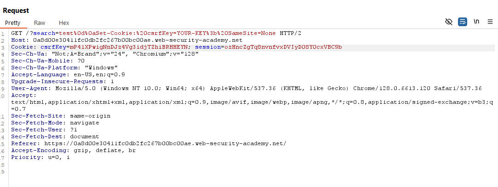
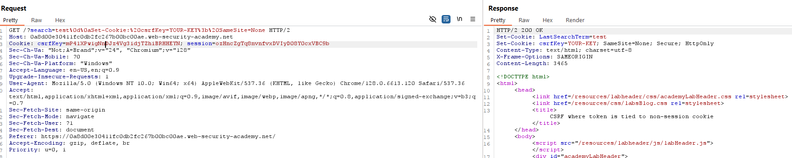

# **CSRF where token is tied to non-session cookie**

This Lab is similar to the previous one in the sense that csrfKey and session token are interchangeable between accounts:



So the first vulnerability is that you can swap both values in the repeater between accounts. Only CSRF and CSRF Key seem to be tied to one another.

Another vulnerability is that your search is getting added to the cookies with any sort of sanitization, so you can overwrite your csrfKey cookie value:



Using this information and the code from previous Labs, we can create a form that does a CSRF to change the email, we need to do a POST to the change-email endpoint, and to set the correct values we do the following:

- The csrf value is sent in the body form params, so we need to add it to the form inputs

<!-- -->

- The csrfKey value needs to be in the cookies, so using the search vulnerability we will inject it.

<!-- -->

- The issue is that we only want 1 action to do both, so instead of auto sending the form, we will setup the cookie in the img src, when the browser tries to retrieve the img it will do the search and set the cookie, and when it fails because is not an image it will submit the form:

```
<form method="POST" action="https://0a8d00e30411fc0db2fc267b00bc00ae.web-security-academy.net/my-account/change-email">
    <input type="hidden" name="email" value="evil@hacker.com">
    <input type="hidden" name="csrf"  value="znO3ml5jIy53hR0q9HEEY4zqYS0R0BQD">
    
</form>
```
