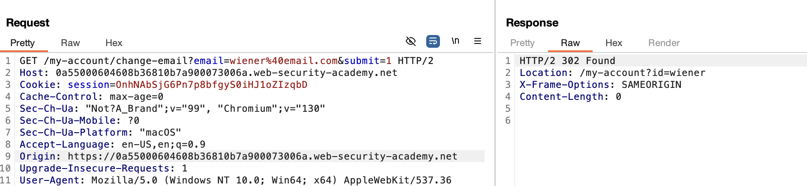
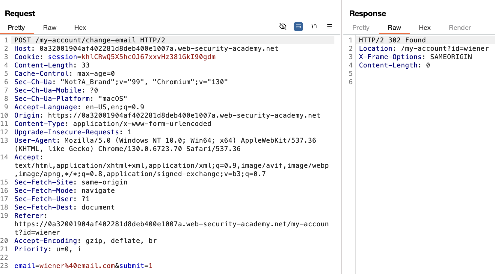
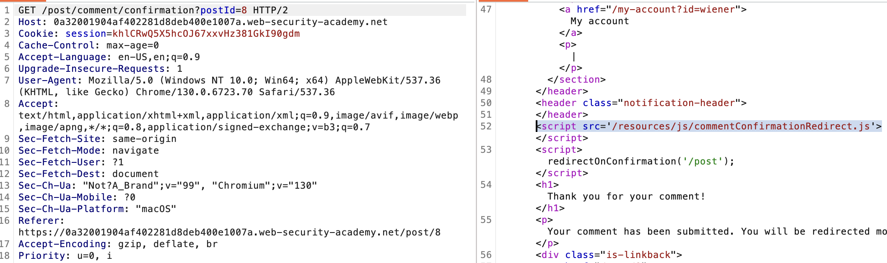
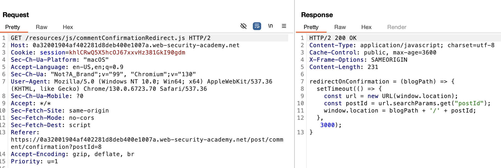

# **SameSite Strict bypass via client-side redirect**

This lab has the complication that session token is:

```
Set-Cookie: session=OnhNAbSjG6Pn7p8bfgyS0iHJ1oZIzqbD; Secure; HttpOnly; SameSite=Strict
```

- **Secure** restricts transmission to HTTPS.

<!-- -->

- **HttpOnly** prevents JavaScript access.

<!-- -->

- **SameSite** provides further CSRF protection by restricting cross-site usage.

Testing the endpoint, we can confirm it also accepts GET requests:



And we can also see that the endpoint is not verifying any CSRF tokens:



Reviewing the Burp history, we can see that the confirmation page is loading a JS script:



And reviewing the code:



It can be seen that an insecure redirection is being done.

So we can build a Payload that redirects to the change email URL with the correct params:

```
<script>
  window.location = "https://0a32001904af402281d8deb400e1007a.web-security-academy.net/post/comment/confirmation?postId=../my-account/change-email?email=evil%40hacker.com%26submit=1"
</script>
```
