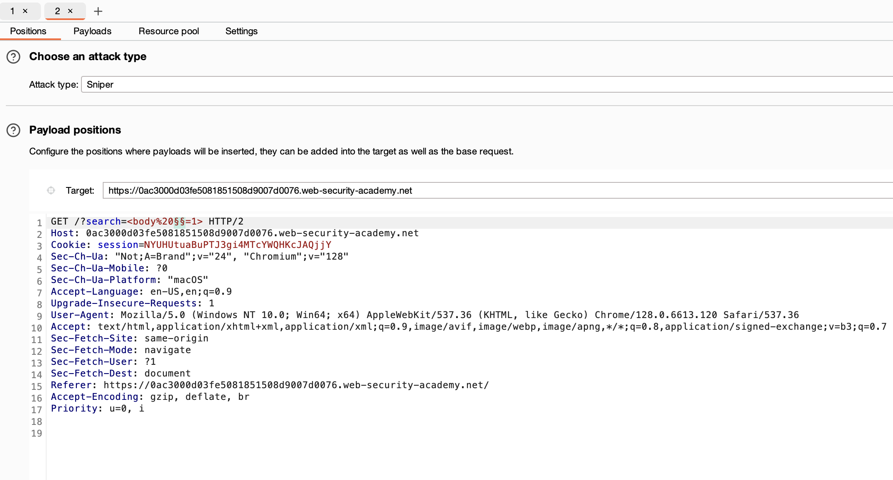
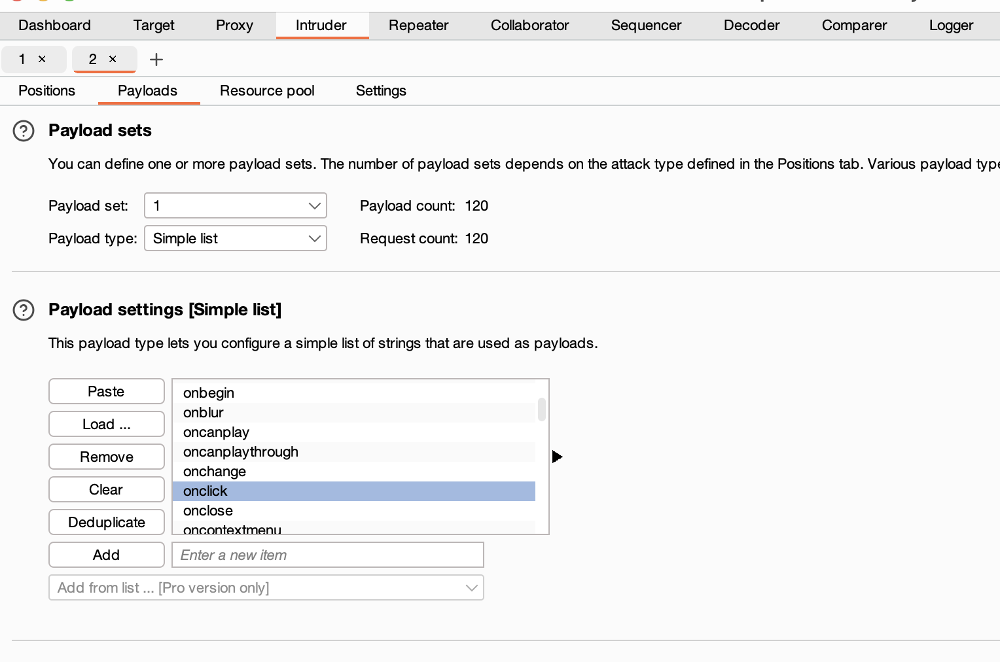

# **Reflected XSS into HTML context with most tags and attributes blocked**

In this one we need to use the intruder to check which tags and events are not being filtered by the WAF, payload is copied from <https://portswigger.net/web-security/cross-site-scripting/cheat-sheet> :



When we get the tag event combination, we have body onresize, and we have to use the “exploit server” and paste this payload:

```
<iframe src="https://YOUR-LAB-ID.web-security-academy.net/?search=%22%3E%3Cbody%20onresize=print()%3E" onload=this.style.width='100px'>
```

In the search to create an iframe in an attacker controlled page, this will print() on the onload size change.
