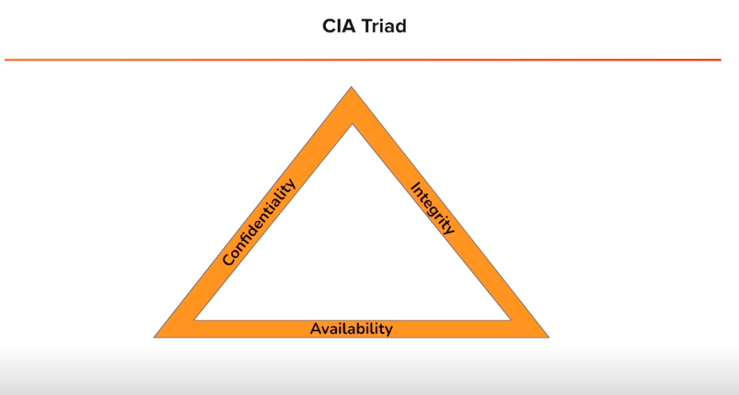

# General

Concepts related to the topics studied and that are more in the theoretical side

<a href="General/Active%20Directory%20992f67b391944fe0a75c51b6c589d6d3.html">Active Directory</a>

<a href="General/Bash%20Scripts%206f76a48d3e914bb0b749b6016c4061fe.html">Bash Scripts</a>

<a href="General/CVSS%20afc0ba5397744383ae5e0b87b3a16347.html">CVSS</a>

<a href="General/FTP%203c839efef4654ed7bc364ac5e0c59177.html">FTP</a>

<a href="General/Google%20Fu%20a338c1fe61704d8a8596b4de59dd3b38.html">Google Fu</a>

<a href="General/Linux%20b6b409bcfacc41c7aed10ff9fbb8603c.html">Linux</a>

<a href="General/Network%20Analysis%206fd17fcb382a450eb28373234463d5b3.html">Network Analysis</a>

<a href="General/OSI%20a09b73dc4aef499c9dc40185b3c106c6.html">OSI</a>

<a href="General/Privacy%20Tools%20116cd8461b06473185d60fc27c535c92.html">Privacy Tools</a>

<a href="General/Resources%20276c0f37c2dd41d38f3865a1934c3e29.html">Resources</a>

<a href="General/Subnet%20IPs%20Definition%2051b2005c4494408dae231abae4aaa508.html">Subnet IPs Definition</a>

<a href="General/Windows%20Commands%20c5f2e067873f4796a629745a8e317d47.html">Windows Commands</a>

<a href="General/MSFConsole%2018e28c47ffa54030a44b7fe9cfe1271e.html">MSFConsole</a>

<a href="General/GRC%20Frameworks%201837de1f1fd04fd3b08c05dd26856aa6.html">GRC Frameworks</a>

<a href="General/Python%20Cheat%20Sheet%204bad8097fa1842a8885b4babd640adc8.html">Python Cheat Sheet</a>

<a href="General/Yara%20Rules%202919cb7e495280fcb41cd34ebfc4f210.html">Yara Rules</a>

<a href="General/JWT%2029c9cb7e495280059961f34c3a00a63d.html">JWT</a>

<a href="General/Cryptography%202d29cb7e49528003bd46cccf23c0c028.html">Cryptography</a>
