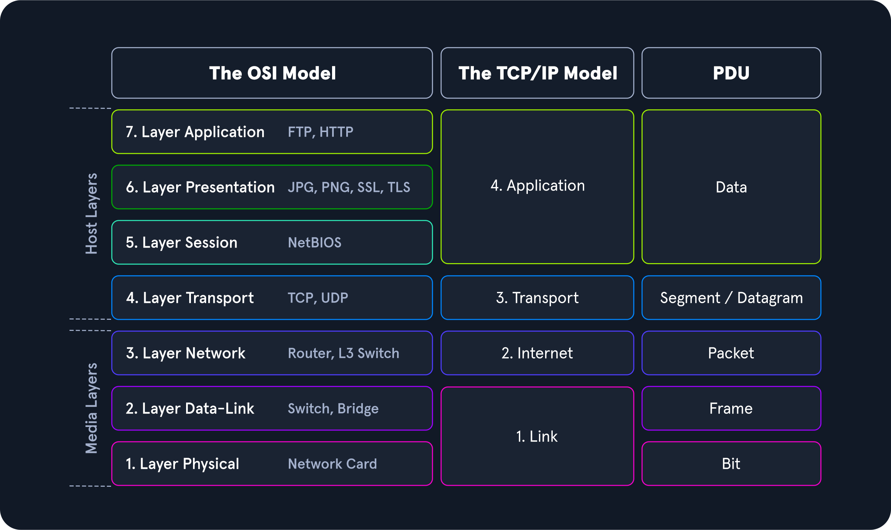
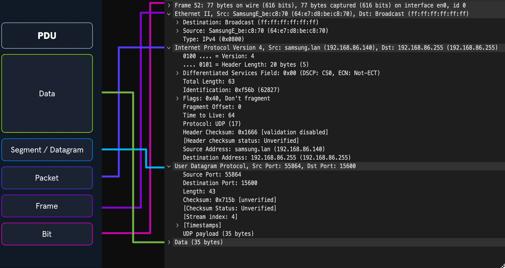
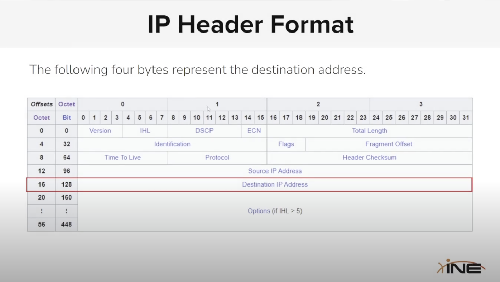
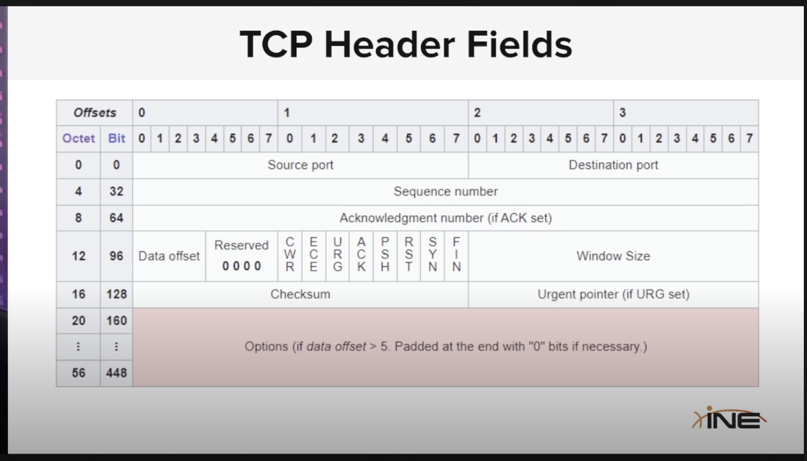

# OSI

1.  Physical - data cables, cat6

<!-- -->

2.  Data - Switching, MAC addresses

<!-- -->

3.  Network - IP addresses, routing

<!-- -->

4.  Transport - TCP/UDP, port numbers

<!-- -->

5.  Session - Sessions management, Sockets, API

<!-- -->

6.  Presentation - Encryption, Compression

<!-- -->

7.  Application - HTTP, FTP, DNS, SMTP

