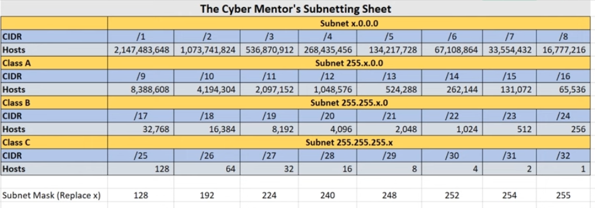
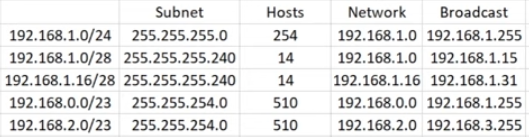

# Subnet IPs Definition

It is /\[number of 1s\] in binary.

When it is /24:

|     |     |     |     |     |     |     |     |     |     |     |     |     |     |     |     |     |     |     |     |     |     |     |     |     |     |     |     |     |     |     |     |     |     |     |
|-----|-----|-----|-----|-----|-----|-----|-----|-----|-----|-----|-----|-----|-----|-----|-----|-----|-----|-----|-----|-----|-----|-----|-----|-----|-----|-----|-----|-----|-----|-----|-----|-----|-----|-----|
| 128 | 64  | 32  | 16  | 8   | 4   | 2   | 1   | .   | 128 | 64  | 32  | 16  | 8   | 4   | 2   | 1   | .   | 128 | 64  | 32  | 16  | 8   | 4   | 2   | 1   | .   | 128 | 64  | 32  | 16  | 8   | 4   | 2   | 1   |
| 1   | 1   | 1   | 1   | 1   | 1   | 1   | 1   | .   | 1   | 1   | 1   | 1   | 1   | 1   | 1   | 1   | .   | 1   | 1   | 1   | 1   | 1   | 1   | 1   | 1   | .   |     |     |     |     |     |     |     |     |

This is 256 ips and 254 available

