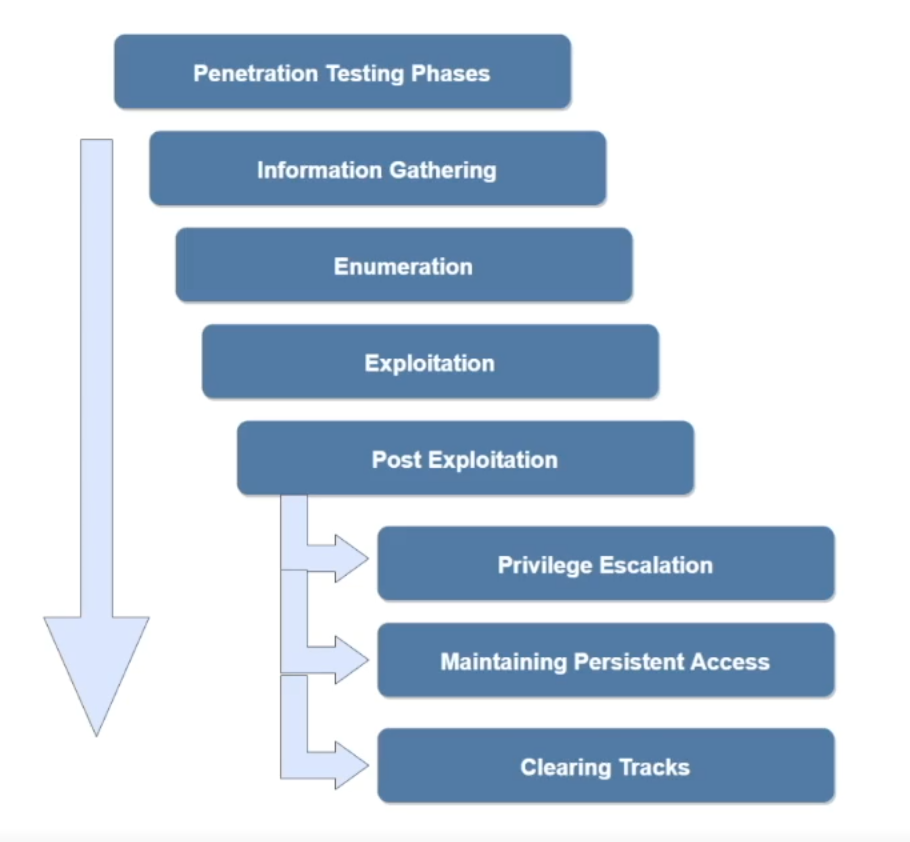

# INE Courses

<a href="INE%20Courses/Assessment%20Methodologies%20Footprinting%20&amp;%20Scanning%20981bd22dd60f4727b3aa07bf7c3daada.html">Assessment Methodologies: Footprinting &amp; Scanning</a>

<a href="INE%20Courses/Assessment%20Methodologies%20Information%20Gathering%20f9b6315bea2b45db9e50184a5edf5d57.html">Assessment Methodologies: Information Gathering</a>

<a href="INE%20Courses/Assessment%20Methodologies%20Enumeration%20e94e0b4ffd5a40b69c3ceed1ac37b2f8.html">Assessment Methodologies: Enumeration</a>

<a href="INE%20Courses/Host%20&amp;%20Network%20Penetration%20Testing%20System%20Host%20Bas%209528621a2e5d40c3a1396b3b53dc7524.html">Host &amp; Network Penetration Testing: System/Host Based Attacks</a>

<a href="INE%20Courses/Windows%20Privilege%20Escalation%201278076f68f3448ba26ab434a798a30b.html">Windows Privilege Escalation</a>

<a href="INE%20Courses/Linux%20Privilege%20Escalation%202137c57e4d69464883ab8cf620a39f47.html">Linux Privilege Escalation</a>

<a href="INE%20Courses/Network%20Based%20Attacks%20b6b17b93939741bcbded0c3f638b619f.html">Network Based Attacks</a>

<a href="INE%20Courses/Metasploit%20Framework%20630883a7da4e4e53b69aae97852e286a.html">Metasploit Framework</a>

<a href="INE%20Courses/Host%20&amp;%20Network%20Penetration%20Testing%20Exploitation%20fa774f47bdd54a3a9330007f5a3472ea.html">Host &amp; Network Penetration Testing: Exploitation</a>

<a href="INE%20Courses/Windows%20Blackbox%20Penetration%20Testing%201089cb7e495280cc8e16c3f349faf19f.html">Windows Blackbox Penetration Testing</a>
