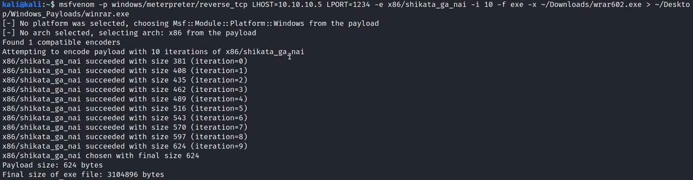
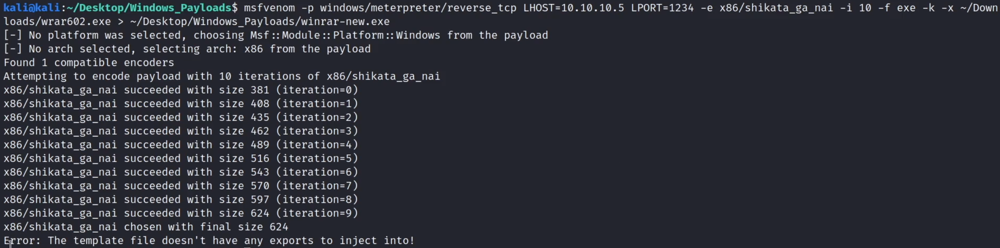

# Injecting Payloads Into Windows Portable Executables

Using Msfvenom you can inject installers .exe with payloads, for example WinRAR:

Using the -k option will maintain the original .exe functionality, but it rarely works:

Also antivirus will detect this very easily.
